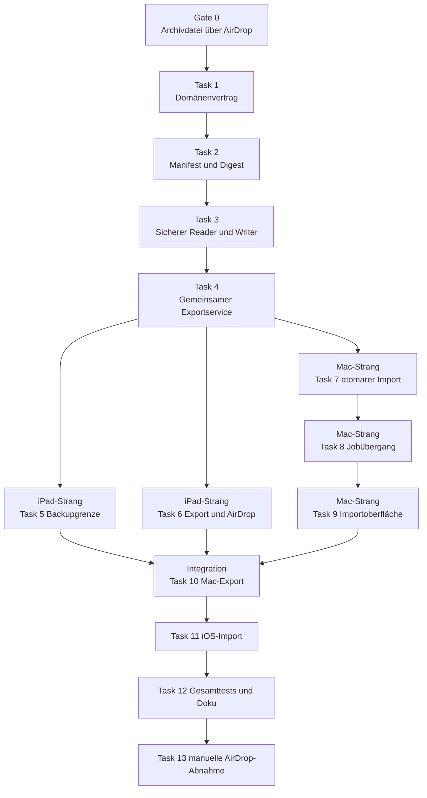

# AirDrop Meeting Transfer Implementation Plan

> **For agentic workers:** REQUIRED SUB-SKILL: Use superpowers:subagent-driven-development (recommended) or superpowers:executing-plans to implement this plan task-by-task. Steps use checkbox (`- [ ]`) syntax for tracking.

**Goal:** Steno überträgt ein einzelnes abgeschlossenes Meeting bewusst als sicheres `.stenomeeting`-Paket zwischen iPad und Mac und kann importiertes iPad-Audio auf dem Mac nach lokaler Bestätigung genau einmal weiterverarbeiten.

**Architecture:** `StenoExchange` besitzt Paketvertrag, kanonischen Inhaltsdigest, einen unkomprimierten AppleArchive-Einzeldateicontainer und die vollständige Untrusted-Input-Prüfung ohne automatisches Entpacken. `StenoLibrary` commitet vorbereitete Imports samt Herkunft und lokalem Transferzustand atomar, während `StenoPipeline` sichtbare Inhalte für den Export materialisiert, die Importentscheidung koordiniert, die Sprache pro Job pinnt und den crashsicheren Import-zu-Job-Übergang abgleicht. Die Plattform-Apps registrieren den regulären Archivdokumenttyp und bleiben dünne Oberflächen für Vorschau, Zustimmung, Systemfreigabe, Dateizugriff, Modellbereitschaft und Status.

**Tech Stack:** Swift 6.3, SwiftUI, AppKit, UIKit, Foundation, AppleArchive, AVFAudio, CryptoKit, UniformTypeIdentifiers, Swift Testing, Swift Package Manager, XcodeGen und Xcode 26.

**Spec:** `docs/superpowers/specs/2026-08-16-airdrop-meeting-transfer-design.md`

## Global Constraints

- V1 verwendet keine iCloud, keinen Cloudspeicher, keinen Server und keine Hintergrundsynchronisierung.
- Die iPadOS-Bibliothek unter `Documents/StenoLibrary` und ihr benachbarter privater Transfer-Validation-Root werden mit `URLResourceValues.isExcludedFromBackup = true` von iCloud-Gerätebackups ausgeschlossen.
- Jedes Paket enthält genau ein Meeting und ist genau eine reguläre Datei mit der Endung `.stenomeeting` sowie der UTType-Kennung `org.steno.meeting-transfer`.
- Der Container ist ein unkomprimierter AppleArchive-Strom, dessen UTType zu `public.archive` und ausdrücklich nicht zu `com.apple.package` konformiert.
- Der Import verwendet niemals `ArchiveStream.extractStream`, übergibt keine ungeprüften Archivpfade an das Dateisystem und führt keine ZIP-Abhängigkeit ein.
- Audio ist bei jedem neuen Export standardmäßig ausgeschaltet und die Auswahl wird nicht gespeichert.
- Sauber beendete Meetings im lokalen Zustand `processing` oder `ready` sind mit vollständig registrierten Medien exportierbar; Audiopakete tragen auf dem Wire kanonisch `ready`.
- `recording`, `interrupted`, Capture-Dateien, Jobs, Runs, Reports, Teilnehmer, Ordner, Personenbibliothek, Review-Daten und Embeddings werden nie exportiert.
- Bestätigte Sprechernamen werden nur als sichtbare Textlabels ohne Personenkennung oder biometrische Evidenz übertragen.
- Die V1-Limits sind 32 Archiveinträge einschließlich Manifest, zwei Unterverzeichnisebenen, 16 GiB je Audiodatei, 24 GiB für alle `DAT`-Bytes einschließlich Manifest, 24 GiB plus 2 MiB äußere Archivdatei, 1 MiB Manifest, 1 MiB Meetingdokument, 64 KiB je Audio-Metadatendatei, 16 MiB Notizen, 64 MiB Transkript, 10.000 Sprecher, 200.000 Turns, 2.000.000 Wörter sowie 1.024 UTF-8-Byte für Titel und Sprecherlabel.
- Ein unbekanntes Hauptschema, eine unbekannte Fähigkeit, eine Extrafile, ein Pfadkonflikt, ein Archiv-Verzeichnis- oder Metadateneintrag, ein Link, ein Spezialfile, ein unbekanntes AppleArchive-Headerfeld, ein falscher Hash oder ungültiges Audio bricht vor jeder Bibliotheksmutation ab.
- Gleiche Ursprungs-ID und gleicher Inhaltsdigest ergeben einen sichtbaren No-op.
- Gleiche Ursprungs-ID und abweichender Inhaltsdigest ergeben einen Konflikt ohne Überschreiben, Merge oder automatische Kopie.
- Ein importiertes Meeting behält die Ursprungs-`MeetingID`, erhält den Status `ready`, leere Teilnehmerfelder und keine Ordnerzuordnung.
- Importierte Notizen landen sofort editierbar in `notes/user-notes.md`.
- Importierte Audiooriginale werden weder transkodiert noch überschrieben.
- Verarbeitung beginnt niemals allein durch Paketinhalt oder Import, sondern nur nach einer lokalen Sprach- und Verarbeitungsbestätigung.
- Eine geschätzte, abgeleitete oder fehlende Sprache muss auf dem Mac ausdrücklich bestätigt werden.
- Der bestätigte `localeIdentifier` wird im finalen ASR-Job und im zugehörigen Run gespeichert.
- Ein fehlendes Modell verhindert weder Import noch Erhalt von Meeting und Audio und erzeugt keinen automatischen Download oder Retry.
- Eine empfangene Klartextdatei außerhalb des App-Containers wird nie still gelöscht oder verändert.
- Neue Fachlogik liegt in `StenoExchange`, `StenoLibrary`, `StenoPipeline` oder `StenoDomain`, nicht doppelt in den Apps.
- Es werden keine neuen Abhängigkeiten eingeführt.
- Fremde unversionierte Dateien, insbesondere `.superpowers/` und `UEBERGABE-sprecher-erkenntnisse.md`, werden nicht verändert oder gestaged.
- Nach jeder Änderung am gemeinsamen Kern laufen beide App-Builds und die vollständigen StenoKit-Tests vor Abschluss der zusammengeführten Umsetzung.

## Geplante Dateistruktur

| Datei | Verantwortung |
|---|---|
| `StenoKit/Sources/StenoDomain/MeetingTransfer.swift` | Gemeinsame Fähigkeiten, Herkunft, Importbeleg, importierte Sprecherlabels und persistierter Processing-Zustand. |
| `StenoKit/Sources/StenoDomain/Identifiers.swift` | `MeetingTransferRequestID` als stabile lokale Request-Kennung. |
| `StenoKit/Sources/StenoDomain/Meeting.swift` | Optionaler unveränderlicher `transferReceipt` in `MeetingMetadata`. |
| `StenoKit/Sources/StenoDomain/TranscriptRevision.swift` | Transferursprung und eindeutig importierte Textlabels ohne Personenbezug. |
| `StenoKit/Sources/StenoDomain/Job.swift` | Optional gepinnter `localeIdentifier` für neue finale ASR-Jobs und rückwärtskompatible alte Jobs. |
| `StenoKit/Sources/StenoDomain/ProcessingRun.swift` | Effektiv verwendete Sprache eines Runs. |
| `StenoKit/Sources/StenoExchange/MeetingTransferManifest.swift` | Versioniertes Manifest, Eintrags-Allowlist und Paketfähigkeiten. |
| `StenoKit/Sources/StenoExchange/MeetingTransferPayload.swift` | Meeting-, Transkript-, Sprecher- und Audiometadaten des portablen Pakets. |
| `StenoKit/Sources/StenoExchange/MeetingTransferLimits.swift` | Eine zentrale Quelle für alle festen V1-Grenzen. |
| `StenoKit/Sources/StenoExchange/MeetingTransferDigest.swift` | Streaming-SHA-256 und kanonischer Inhaltsdigest. |
| `StenoKit/Sources/StenoExchange/MeetingTransferArchiveWriter.swift` | Allowlist-basierter, atomarer Aufbau einer unkomprimierten AppleArchive-Einzeldatei. |
| `StenoKit/Sources/StenoExchange/MeetingTransferArchiveReader.swift` | Headerweise Struktur-, Pfad-, Schema-, Größen- und Hashprüfung ohne automatisches Entpacken. |
| `StenoKit/Sources/StenoExchange/MeetingTransferPrivateRoot.swift` | Gemeinsame no-follow-gesicherte 0700-Erzeugung und Prüfung privater Validation- und Export-Roots. |
| `StenoKit/Sources/StenoExchange/MeetingTransferAudioInspector.swift` | Inhaltliche AVAudioFile-Prüfung und Ableitung vertrauenswürdiger Audiowerte. |
| `StenoKit/Sources/StenoPipeline/MeetingTransferExportService.swift` | Gemeinsame Exportbereitschaft, Notizen, Transkript-Snapshot und bestätigte Sprechertextlabels. |
| `StenoKit/Sources/StenoLibrary/MeetingTransferStateStore.swift` | Versionierte Datei `transfer-state.json` im Meetingverzeichnis und atomare Zustandsübergänge. |
| `StenoKit/Sources/StenoLibrary/MeetingTransferImport.swift` | Fail-closed Deduplizierung und atomarer Commit eines vorbereiteten Transferimports. |
| `StenoKit/Sources/StenoLibrary/PreparedMeetingImport.swift` | Optionale Revision und optionaler Transferzustand im bestehenden Staging-Unterbau. |
| `StenoKit/Sources/StenoLibrary/LibraryLayout.swift` | Stabiler Pfad zur Transferzustandsdatei. |
| `StenoKit/Sources/StenoLibrary/JobStore.swift` | Idempotentes Sicherstellen einer vorab festgelegten Job-ID. |
| `StenoKit/Sources/StenoPipeline/MeetingTransferImportService.swift` | Erneute Paketprüfung, Vorschau, Importaufbereitung und lokale Prozessentscheidung. |
| `StenoKit/Sources/StenoPipeline/ImportedMeetingProcessingReconciler.swift` | Crashsicherer Abgleich zwischen persistierter Request und globalem JobStore. |
| `StenoKit/Sources/StenoPipeline/PipelineCoordinator.swift` | Verwendung der Job-Sprache statt der globalen Sprache für finalen ASR. |
| `StenoKit/Sources/StenoPipeline/PipelineStartup.swift` | Reconciliation vor dem Start des Queue-Consumers. |
| `iOS/App/Sources/LibraryBackupPolicy.swift` | Setzen und Prüfen der iCloud-Backup-Ausnahme für Bibliothek und privaten Transfer-Validation-Root. |
| `iOS/App/Sources/AppModel+MeetingTransfer.swift` | Dünne iPad-Aktionen über den gemeinsamen Export- und Importservice. |
| `iOS/App/Sources/MeetingTransferExportSheet.swift` | Textvorschau, ausgeschalteter Audio-Schalter, Größen und Warnungen. |
| `iOS/App/Sources/MeetingTransferShareSheet.swift` | `UIActivityViewController` mit Abschlusscallback und sicherer Temp-Aufräumgrenze. |
| `iOS/App/Sources/MeetingTransferImportSheet.swift` | Validierungsfortschritt, Vorschau, No-op, Konflikt und ausdrücklicher Import. |
| `iOS/App/Sources/MeetingTransferDocumentType.swift` | App-lokale `UTType.stenoMeetingTransfer`. |
| `iOS/App/Sources/MeetingDetailView.swift` | Exportaktion und sichtbarer Importhinweis. |
| `iOS/App/Sources/StenoApp.swift` | Öffnen empfangener `.stenomeeting`-Dokumente. |
| `iOS/project.yml` | Export- und Importdeklaration des regulären Archivdokumenttyps. |
| `App/Sources/AppModel+MeetingTransfer.swift` | Dünne Mac-Aktionen über Import-, Export-, Modell- und Reconciler-Services. |
| `App/Sources/MeetingTransferImportView.swift` | Mac-Vorschau, Sprachbestätigung, Modellzustand und Importentscheidung. |
| `App/Sources/MeetingTransferExportView.swift` | Mac-Exportvorschau und Audiozustimmung. |
| `App/Sources/MeetingTransferSharing.swift` | Systemfreigabe und Entfernung ausschließlich eigener temporärer Pakete. |
| `App/Sources/MeetingTransferDocumentType.swift` | App-lokale `UTType.stenoMeetingTransfer`. |
| `App/Sources/ContentView.swift` | Dokumentöffnung und Präsentation des Importflusses. |
| `App/Sources/MeetingDetailView.swift` | Exportaktion, Importbadge und Processing-Aktionen. |
| `project.yml` | Export- und Importdeklaration des regulären Archivdokumenttyps auf macOS. |
| `docs/PLAN-PRIVACY.md` | Enge Ausnahme für bewusstes lokales Audio-Teilen und Klartextgrenzen. |
| `docs/PLAN-IOS.md` | Neue Entscheidung gegen iCloud-Gerätebackup der unverschlüsselten Bibliothek. |

## Abhängigkeiten und Parallelisierungsgrenzen



Nach Task 4 dürfen Task 5 und Task 6 im iPad-Arbeitsstrang parallel zu Task 7 bis Task 9 im Mac-Arbeitsstrang laufen.
Der iPad-Strang verändert danach ausschließlich `iOS/` und die dazugehörigen iOS-App-Tests.
Der Mac-Strang verändert `StenoLibrary`, `StenoPipeline`, `App/` und deren Tests, aber keine iOS-Datei.
Beide Stränge dürfen `StenoDomain`, `StenoExchange`, `StenoKit/Package.swift` und die in Task 1 bis Task 4 eingeführten Schnittstellen nach dem Parallelisierungs-Gate nicht eigenmächtig ändern.
Ein notwendiger Vertragswechsel stoppt beide Stränge und wird zuerst als gemeinsamer Task mit beiden fokussierten Tests integriert.
Task 10 beginnt erst, wenn beide Primärstränge grün und auf demselben gemeinsamen Fundament zusammengeführt sind.

---

### Gate 0: Reguläre AppleArchive-Datei über AirDrop nachweisen

Das frühere `com.apple.package`-Gate ist nach dem realen Test gescheitert.
Nach dem AirDrop-Hin- und Rückweg lag nur das bytegleiche innere `manifest.json` in `Downloads`, nicht `Probe.stenomeeting`.
Dieser Gate-Abschnitt ersetzt die widerlegte Verzeichniscontainer-Annahme vollständig.

**Files:**
- Modify: `project.yml`
- Modify: `iOS/project.yml`
- Create: `StenoKit/Tests/StenoExchangeTests/Fixtures/ProbeArchiveInput/manifest.json`

**Interfaces:**
- Consumes: Eine unkomprimierte AppleArchive-Datei mit Endung `.stenomeeting`, UTType-Kennung `org.steno.meeting-transfer` und Konformität zu `public.archive`.
- Produces: Eine real bestätigte Einzeldatei-Transportentscheidung für alle späteren Reader-, Writer- und UI-Aufgaben.

- [ ] **Step 1: Lege den wiederverwendbaren Probeinhalt an.**

`StenoKit/Tests/StenoExchangeTests/Fixtures/ProbeArchiveInput/manifest.json` enthält ausschließlich:

```json
{
  "formatMajor": 1,
  "formatMinor": 0,
  "probe": true
}
```

Dieser Diagnoseinhalt ist kein importierbares Meeting und wird vom späteren Produktreader ausdrücklich abgelehnt.

- [ ] **Step 2: Erzeuge mit Apples Systemwerkzeug eine unkomprimierte Einzeldatei-Probe.**

Run:

```bash
mkdir -p .superpowers/sdd/2026-08-16-airdrop-meeting-transfer/gate-0-probe
aa archive -a raw \
  -i StenoKit/Tests/StenoExchangeTests/Fixtures/ProbeArchiveInput/manifest.json \
  -o .superpowers/sdd/2026-08-16-airdrop-meeting-transfer/gate-0-probe/Probe.stenomeeting \
  -exclude-field all -include-field typ,pat,siz,dat
test -f .superpowers/sdd/2026-08-16-airdrop-meeting-transfer/gate-0-probe/Probe.stenomeeting
test ! -d .superpowers/sdd/2026-08-16-airdrop-meeting-transfer/gate-0-probe/Probe.stenomeeting
aa list -i .superpowers/sdd/2026-08-16-airdrop-meeting-transfer/gate-0-probe/Probe.stenomeeting -list-format json | \
  jq -e 'length == 1 and .[0].TYP == "F" and .[0].PAT == "manifest.json" and .[0].SIZ == 60'
shasum -a 256 .superpowers/sdd/2026-08-16-airdrop-meeting-transfer/gate-0-probe/Probe.stenomeeting \
  > .superpowers/sdd/2026-08-16-airdrop-meeting-transfer/gate-0-probe/Probe.sha256
```

Expected: Die Probe ist genau eine reguläre Datei, enthält genau einen regulären Archiveintrag `manifest.json`, ist unkomprimiert und ihr SHA-256-Wert ist protokolliert.

- [ ] **Step 3: Prüfe die reguläre Datei manuell auf echten Geräten.**

Sende `.superpowers/sdd/2026-08-16-airdrop-meeting-transfer/gate-0-probe/Probe.stenomeeting` im Finder per AirDrop an das entsperrte iPad, speichere sie in Dateien, sende sie von dort unverändert per AirDrop an den Mac zurück und prüfe danach:

```bash
test -f "~/Downloads/Probe.stenomeeting"
test ! -d "~/Downloads/Probe.stenomeeting"
aa list -i "~/Downloads/Probe.stenomeeting" -list-format json | \
  jq -e 'length == 1 and .[0].TYP == "F" and .[0].PAT == "manifest.json" and .[0].SIZ == 60'
expected_sha="$(awk '{print $1}' .superpowers/sdd/2026-08-16-airdrop-meeting-transfer/gate-0-probe/Probe.sha256)"
returned_sha="$(shasum -a 256 ~/Downloads/Probe.stenomeeting | awk '{print $1}')"
test "$returned_sha" = "$expected_sha"
verify_root="$(mktemp -d)"
aa extract -i "~/Downloads/Probe.stenomeeting" -d "$verify_root"
cmp "$verify_root/manifest.json" \
  StenoKit/Tests/StenoExchangeTests/Fixtures/ProbeArchiveInput/manifest.json
```

Expected: Der Rückweg liefert genau eine reguläre `.stenomeeting`-Datei, der äußere SHA-256-Wert stimmt mit Step 2 überein, AppleArchive listet weiterhin nur den erlaubten regulären Eintrag und das Manifest ist bytegleich.
Wenn eine dieser Bedingungen fehlschlägt, endet die Umsetzung erneut vor Task 1 und die Transportentscheidung geht zurück in die Architekturprüfung.

- [ ] **Step 4: Registriere nach bestandenem Transportgate den regulären Archivdokumenttyp.**

Ergänze in beiden `project.yml` unter `info.properties` dieselben Deklarationen:

```yaml
UTExportedTypeDeclarations:
  - UTTypeIdentifier: org.steno.meeting-transfer
    UTTypeDescription: Steno Meeting
    UTTypeConformsTo:
      - public.archive
    UTTypeTagSpecification:
      public.filename-extension:
        - stenomeeting
CFBundleDocumentTypes:
  - CFBundleTypeName: Steno Meeting
    LSItemContentTypes:
      - org.steno.meeting-transfer
    CFBundleTypeRole: Editor
```

- [ ] **Step 5: Erzeuge beide Projekte, baue sie und registriere den endgültigen Typ auf beiden Geräten.**

Run:

```bash
xcodegen generate
scripts/build-app.sh
scripts/build-ios.sh
scripts/build-ios.sh --device
STENO_LIBRARY_DIR="$(mktemp -d)/StenoLibrary" scripts/build-app.sh --run
```

Expected: Beide Builds enden mit Exit 0, beide erzeugten Info.plists enthalten `org.steno.meeting-transfer` mit Konformität `public.archive`, der unveränderte Build läuft auf dem entsperrten iPad und der Mac-Build registriert seinen Dokumenttyp ohne eine bestehende Steno-Bibliothek zu öffnen.

- [ ] **Step 6: Wiederhole den vollständigen AirDrop-Roundtrip mit dem installierten endgültigen UTType.**

Kopiere die bereits geprüfte Probe unter einen eindeutigen Namen, protokolliere ihren Hash und stelle sicher, dass das Empfangsziel frei ist:

```bash
cp .superpowers/sdd/2026-08-16-airdrop-meeting-transfer/gate-0-probe/Probe.stenomeeting \
  .superpowers/sdd/2026-08-16-airdrop-meeting-transfer/gate-0-probe/Probe-Registered.stenomeeting
shasum -a 256 .superpowers/sdd/2026-08-16-airdrop-meeting-transfer/gate-0-probe/Probe-Registered.stenomeeting \
  > .superpowers/sdd/2026-08-16-airdrop-meeting-transfer/gate-0-probe/Probe-Registered.sha256
test ! -e "~/Downloads/Probe-Registered.stenomeeting"
```

Sende `Probe-Registered.stenomeeting` erneut Mac -> iPad Dateien -> Mac und prüfe anschließend:

```bash
test -f "~/Downloads/Probe-Registered.stenomeeting"
test ! -d "~/Downloads/Probe-Registered.stenomeeting"
registered_expected="$(awk '{print $1}' .superpowers/sdd/2026-08-16-airdrop-meeting-transfer/gate-0-probe/Probe-Registered.sha256)"
registered_returned="$(shasum -a 256 ~/Downloads/Probe-Registered.stenomeeting | awk '{print $1}')"
test "$registered_returned" = "$registered_expected"
aa list -i "~/Downloads/Probe-Registered.stenomeeting" -list-format json | \
  jq -e 'length == 1 and .[0].TYP == "F" and .[0].PAT == "manifest.json" and .[0].SIZ == 60'
mdls -raw -name kMDItemContentType "~/Downloads/Probe-Registered.stenomeeting"
```

Expected: Die registrierte Fassung bleibt ebenfalls eine bytegleiche reguläre Einzeldatei, AppleArchive listet genau das Manifest und Spotlight meldet `org.steno.meeting-transfer`.
Ein Fehlschlag stoppt die Umsetzung vor Task 1.

- [ ] **Step 7: Committe ausschließlich Typdeklaration und Probeinhalt.**

```bash
git add project.yml iOS/project.yml \
  StenoKit/Tests/StenoExchangeTests/Fixtures/ProbeArchiveInput/manifest.json
git commit -m "chore: register Steno meeting archive type"
```

### Task 1: Gemeinsame Transfer-, Sprecher- und Sprachmodelle

**Files:**
- Create: `StenoKit/Sources/StenoDomain/MeetingTransfer.swift`
- Modify: `StenoKit/Sources/StenoDomain/Identifiers.swift`
- Modify: `StenoKit/Sources/StenoDomain/Meeting.swift`
- Modify: `StenoKit/Sources/StenoDomain/TranscriptRevision.swift`
- Modify: `StenoKit/Sources/StenoDomain/Job.swift`
- Modify: `StenoKit/Sources/StenoDomain/ProcessingRun.swift`
- Modify: `StenoKit/Sources/StenoLibrary/LibraryLayout.swift`
- Modify: `StenoKit/Sources/StenoPipeline/MeetingReview.swift`
- Modify: `StenoKit/Sources/StenoPipeline/MeetingMarkdown.swift`
- Modify: `StenoKit/Sources/StenoPipeline/TemplateParticipants.swift`
- Modify: `StenoKit/Sources/StenoIntelligence/TemplateRenderer.swift`
- Modify: `App/Sources/AppModel+Review.swift`
- Modify: `App/Sources/MeetingDetailView.swift`
- Modify: `iOS/App/Sources/SpeakerDisplay.swift`
- Create: `StenoKit/Tests/StenoDomainTests/MeetingTransferModelTests.swift`
- Modify: `StenoKit/Tests/StenoLibraryTests/LibraryLayoutTests.swift`
- Modify: `StenoKit/Tests/StenoPipelineTests/MeetingMarkdownTests.swift`

**Interfaces:**
- Consumes: `MeetingID`, `RevisionID`, `JobID`, `SpeakerReference`, `MeetingMetadata`, `Job` und `ProcessingRun`.
- Produces: `MeetingTransferCapability`, `MeetingTransferLocaleOrigin`, `MeetingTransferReceipt`, `MeetingTransferRequestID`, `ImportedSpeakerTextLabel`, `ImportedProcessingRequest`, `ImportedMeetingProcessingState` und den gemeinsamen `LibraryLayout.transferValidationRoot`.

- [ ] **Step 1: Schreibe rote Codable- und Semantiktests.**

Erzeuge Tests für rückwärtskompatibles Decode alter Meetings, Jobs und Runs sowie für die neue Labelart:

```swift
@Test("old jobs decode without a pinned locale")
func oldJobDecodesWithoutLocale() throws {
    let data = try fixtureJobJSON(removing: "localeIdentifier")
    #expect(try JSONDecoder().decode(Job.self, from: data).localeIdentifier == nil)
}

@Test("imported speaker label carries text but no person identity")
func importedLabelIsTextOnly() {
    let label = ImportedSpeakerTextLabel(
        id: UUID(uuidString: "00000000-0000-7000-8000-000000000010")!,
        text: "Ada",
        wasConfirmedAtSource: true
    )
    #expect(SpeakerReference.importedTextLabel(label) != .person(PersonID()))
}

@Test("meeting metadata decodes without a transfer receipt")
func oldMeetingMetadataRemainsReadable() throws {
    let data = Data(#"{"legacyProvenanceKey":null,"legacyFolders":[]}"#.utf8)
    #expect(try JSONDecoder().decode(MeetingMetadata.self, from: data).transferReceipt == nil)
}
```

Ergänze Renderingtests, die ein importiertes Label als `Ada` ausgeben, ihm keine Personenfarbe geben und es nicht als lokale Person oder bestätigte Review-Evidenz behandeln.

- [ ] **Step 2: Führe die roten Domänen- und Renderingtests aus.**

Run:

```bash
swift test --package-path StenoKit --filter MeetingTransferModelTests
swift test --package-path StenoKit --filter LibraryLayoutTests
swift test --package-path StenoKit --filter MeetingMarkdownTests
```

Expected: FAIL, weil die Transfertypen, neuen Felder und die neue `SpeakerReference`-Variante fehlen.

- [ ] **Step 3: Definiere die gemeinsamen Typen.**

`MeetingTransfer.swift` erhält diese öffentlichen Verträge:

```swift
public enum MeetingTransferCapability: String, Codable, CaseIterable, Sendable {
    case notes
    case transcript
    case audio
}

public enum MeetingTransferLocaleOrigin: String, Codable, Sendable {
    case explicit
    case estimated
    case absent
}

public struct MeetingTransferReceipt: Codable, Equatable, Sendable {
    public let sourceMeetingID: MeetingID
    public let sourceRevisionID: RevisionID?
    public let sourcePackageContentDigest: String
    public let importedAt: Date
    public let sourceAppVersion: String?
    public let includedCapabilities: Set<MeetingTransferCapability>
    public let sourceLocaleIdentifier: String?
    public let sourceLocaleOrigin: MeetingTransferLocaleOrigin
}

public struct ImportedSpeakerTextLabel: Codable, Equatable, Hashable, Sendable {
    public let id: UUID
    public let text: String
    public let wasConfirmedAtSource: Bool
}

public struct ImportedProcessingRequest: Codable, Equatable, Sendable {
    public let id: MeetingTransferRequestID
    public let jobID: JobID
    public let meetingID: MeetingID
    public let localeIdentifier: String
    public let createdAt: Date
}

public enum ImportedMeetingProcessingState: Codable, Equatable, Sendable {
    case importedOnly
    case awaitingLanguageConfirmation
    case awaitingModel(localeIdentifier: String)
    case processingRequested(ImportedProcessingRequest)
    case jobEnqueued(jobID: JobID, localeIdentifier: String)
    case needsManualRetry(jobID: JobID, localeIdentifier: String, reason: String)
}
```

Füge `MeetingTransferRequestID` nach demselben `StenoIdentifier`-Muster wie `JobID` hinzu.
Ergänze `MeetingMetadata.transferReceipt`, `SpeakerReference.importedTextLabel`, `TranscriptOrigin.meetingTransfer(sourceMeetingID:sourceRevisionID:)`, `Job.localeIdentifier` und `ProcessingRun.localeIdentifier` jeweils rückwärtskompatibel optional.
Ergänze `LibraryLayout.transferValidationRoot` als `root.deletingLastPathComponent().appending(path: ".StenoTransferValidation", directoryHint: .isDirectory)`.
`LibraryLayoutTests` verlangt, dass dieser Pfad ein Geschwister des Bibliotheksroots auf demselben Elternpfad ist, nie unter `meetings` liegt und für Mac- sowie iOS-Bibliothekspfade deterministisch gleich abgeleitet wird.

- [ ] **Step 4: Ergänze alle erschöpfenden Sprecherpfade.**

Die neue Referenz wird nach diesem gemeinsamen Vertrag behandelt:

```swift
case .importedTextLabel(let imported):
    return imported.text
```

`SpeakerDisplay.color`, Review-Resolver und Sample-Auswahl geben für importierte Textlabels keine Personenfarbe und keine biometrische Zuordnung zurück.
Markdown und Template-Text dürfen das sichtbare Label ausgeben, aber `TemplateParticipants` darf daraus keine lokale `PersonID` erzeugen.

- [ ] **Step 5: Führe fokussierte Tests und beide Compile-Gates aus.**

Run:

```bash
swift test --package-path StenoKit --filter MeetingTransferModelTests
swift test --package-path StenoKit --filter LibraryLayoutTests
swift test --package-path StenoKit --filter MeetingMarkdownTests
xcodegen generate
scripts/build-app.sh
scripts/build-ios.sh
```

Expected: Alle fokussierten Tests bestehen und beide Apps bauen mit der neuen erschöpfenden Enum-Variante.

- [ ] **Step 6: Committe den gemeinsamen Domänenvertrag.**

```bash
git add StenoKit/Sources/StenoDomain \
  StenoKit/Sources/StenoLibrary/LibraryLayout.swift \
  StenoKit/Sources/StenoPipeline/MeetingReview.swift \
  StenoKit/Sources/StenoPipeline/MeetingMarkdown.swift \
  StenoKit/Sources/StenoPipeline/TemplateParticipants.swift \
  StenoKit/Sources/StenoIntelligence/TemplateRenderer.swift \
  App/Sources/AppModel+Review.swift App/Sources/MeetingDetailView.swift \
  iOS/App/Sources/SpeakerDisplay.swift \
  StenoKit/Tests/StenoDomainTests/MeetingTransferModelTests.swift \
  StenoKit/Tests/StenoLibraryTests/LibraryLayoutTests.swift \
  StenoKit/Tests/StenoPipelineTests/MeetingMarkdownTests.swift
git commit -m "feat: add meeting transfer domain contract"
```

### Task 2: Versioniertes Manifest, Payloads, Limits und kanonischer Digest

**Files:**
- Create: `StenoKit/Sources/StenoExchange/MeetingTransferManifest.swift`
- Create: `StenoKit/Sources/StenoExchange/MeetingTransferPayload.swift`
- Create: `StenoKit/Sources/StenoExchange/MeetingTransferLimits.swift`
- Create: `StenoKit/Sources/StenoExchange/MeetingTransferDigest.swift`
- Create: `StenoKit/Tests/StenoExchangeTests/MeetingTransferContractTests.swift`
- Create: `StenoKit/Tests/StenoExchangeTests/MeetingTransferDigestTests.swift`

**Interfaces:**
- Consumes: Die Transferfähigkeiten, Locale-Herkunft und Identifikatoren aus Task 1.
- Produces: `MeetingTransferManifest`, `MeetingTransferMeetingDocument`, `MeetingTransferTranscriptSnapshot`, `MeetingTransferAudioDocument`, `MeetingTransferPackageContent`, `MeetingTransferProgress`, `MeetingTransferLimits` und `MeetingTransferDigest`.

- [ ] **Step 1: Schreibe rote Schema-, Profil- und Digesttests.**

```swift
@Test("content digest ignores export metadata and entry order")
func digestIsCanonical() throws {
    let first = try digest(entries: [notesEntry, transcriptEntry], exportedAt: .distantPast)
    let second = try digest(entries: [transcriptEntry, notesEntry], exportedAt: .distantFuture)
    #expect(first == second)
}

@Test("an empty package profile is rejected")
func emptyProfileFails() {
    #expect(throws: MeetingTransferContractError.emptyPayload) {
        try MeetingTransferPackageContent(meeting: meeting, notes: nil, transcript: nil, audio: [])
    }
}

@Test("recording payload requires ready source meeting")
func recordingRequiresReadyMeeting() {
    #expect(throws: MeetingTransferContractError.audioRequiresReadyMeeting) {
        try content(status: .interrupted, audio: [audioSource])
    }
}
```

Ergänze Roundtriptests für Text, Aufnahme und Text mit Aufnahme sowie Decode-Ablehnung für Hauptversion 2, unbekannte Fähigkeiten und widersprüchliche Capability-Listen.
Teste außerdem, dass `manifest.json` nicht in `entries` oder `contentDigest` eingeht, das 32-Dateien-Limit das Manifest mitzählt und Manifest, Meetingdokument sowie Audio-Metadaten ihre eigenen Bytegrenzen erzwingen.

- [ ] **Step 2: Führe die roten Contract-Tests aus.**

Run:

```bash
swift test --package-path StenoKit --filter MeetingTransferContractTests
swift test --package-path StenoKit --filter MeetingTransferDigestTests
```

Expected: FAIL, weil Manifest, Payloadtypen, Limits und Digest fehlen.

- [ ] **Step 3: Implementiere das geschlossene Manifestmodell.**

Verwende diese stabile Form:

```swift
public struct MeetingTransferManifest: Codable, Equatable, Sendable {
    public static let currentMajor = 1
    public static let currentMinor = 0
    public let formatMajor: Int
    public let formatMinor: Int
    public let sourceMeetingID: MeetingID
    public let sourceRevisionID: RevisionID?
    public let exportedAt: Date
    public let sourceAppVersion: String?
    public let capabilities: Set<MeetingTransferCapability>
    public let localeIdentifier: String?
    public let localeOrigin: MeetingTransferLocaleOrigin
    public let entries: [Entry]
    public let contentDigest: String
}
```

`Entry` enthält ausschließlich `path`, `byteCount`, `mediaType` und `sha256`.
Die Payloadtypen enthalten keine lokalen Personen-, Ordner-, Teilnehmer-, Job-, Run-, Report- oder Review-Felder.
`manifest.json` steht nie in seiner eigenen `entries`-Liste, besitzt keinen eigenen Datei-Hash und geht nicht in den `contentDigest` ein.
Das Dateilimit zählt das Manifest und alle in `entries` beschriebenen Nutzdateien gemeinsam.

```swift
public struct MeetingTransferProgress: Equatable, Sendable {
    public enum Phase: Equatable, Sendable { case enumerating, hashing, readingArchive, validatingAudio, writing }
    public let phase: Phase
    public let processedBytes: Int64
    public let totalBytes: Int64
}
```

- [ ] **Step 4: Implementiere feste Limits und Streaming-Digest.**

```swift
public enum MeetingTransferLimits {
    public static let maximumFileCount = 32
    public static let maximumDirectoryDepth = 2
    public static let maximumAudioBytes: Int64 = 16 * 1_024 * 1_024 * 1_024
    public static let maximumTotalBytes: Int64 = 24 * 1_024 * 1_024 * 1_024
    public static let maximumArchiveOverheadBytes: Int64 = 2 * 1_024 * 1_024
    public static let maximumTransportFileBytes = maximumTotalBytes + maximumArchiveOverheadBytes
    public static let maximumManifestBytes = 1 * 1_024 * 1_024
    public static let maximumMeetingDocumentBytes = 1 * 1_024 * 1_024
    public static let maximumAudioMetadataBytes = 64 * 1_024
    public static let minimumFreeSpaceReserveBytes: Int64 = 2_000_000_000
    public static let maximumNotesBytes = 16 * 1_024 * 1_024
    public static let maximumTranscriptBytes = 64 * 1_024 * 1_024
    public static let maximumSpeakers = 10_000
    public static let maximumTurns = 200_000
    public static let maximumWords = 2_000_000
    public static let maximumLabelBytes = 1_024
}
```

`MeetingTransferDigest.sha256(of:)` liest mit `FileHandle` in 1-MiB-Blöcken und prüft zwischen Blöcken `Task.checkCancellation()`.
Der Inhaltsdigest hasht die UTF-8-Darstellung von sortiertem Pfad, Bytegröße und Dateihash aller Manifest-`entries` mit eindeutigen Längenpräfixen und enthält weder `manifest.json` noch Exportzeit oder App-Version.

- [ ] **Step 5: Führe die Contract-Tests grün aus.**

Run:

```bash
swift test --package-path StenoKit --filter MeetingTransferContractTests
swift test --package-path StenoKit --filter MeetingTransferDigestTests
```

Expected: Alle Profil-, Schema-, Grenz- und Kanonisierungsfälle bestehen.

- [ ] **Step 6: Committe ausschließlich Paketvertrag und Digest.**

```bash
git add StenoKit/Sources/StenoExchange/MeetingTransferManifest.swift \
  StenoKit/Sources/StenoExchange/MeetingTransferPayload.swift \
  StenoKit/Sources/StenoExchange/MeetingTransferLimits.swift \
  StenoKit/Sources/StenoExchange/MeetingTransferDigest.swift \
  StenoKit/Tests/StenoExchangeTests/MeetingTransferContractTests.swift \
  StenoKit/Tests/StenoExchangeTests/MeetingTransferDigestTests.swift
git commit -m "feat: define Steno meeting package contract"
```

### Task 3: Gehärteter AppleArchive-Writer und Untrusted-Input-Reader

**Files:**
- Create: `StenoKit/Sources/StenoExchange/MeetingTransferArchiveWriter.swift`
- Create: `StenoKit/Sources/StenoExchange/MeetingTransferArchiveReader.swift`
- Create: `StenoKit/Sources/StenoExchange/MeetingTransferPrivateRoot.swift`
- Create: `StenoKit/Sources/StenoExchange/MeetingTransferAudioInspector.swift`
- Create: `StenoKit/Tests/StenoExchangeTests/MeetingTransferArchiveWriterTests.swift`
- Create: `StenoKit/Tests/StenoExchangeTests/MeetingTransferArchiveSecurityTests.swift`
- Create: `StenoKit/Tests/StenoExchangeTests/MeetingTransferAudioInspectorTests.swift`

**Interfaces:**
- Consumes: `MeetingTransferPackageContent`, `MeetingTransferManifest`, `MeetingTransferLimits` und `MeetingTransferDigest` aus Task 2.
- Produces: `MeetingTransferPrivateRoot.prepareAndVerify(at:)`, `MeetingTransferArchiveWriter.write(_:to:progress:)`, `MeetingTransferArchiveReader.validate(at:validationRoot:progress:)`, `ValidatedMeetingTransferPackage`, dessen äußerer `transportDigest`, und `ValidatedMeetingTransferAudio`.

- [ ] **Step 1: Schreibe rote Writer- und Roundtriptests.**

```swift
@Test("writer produces one regular uncompressed archive and validates it")
func writerRoundTripsTextPackage() async throws {
    let url = try await writer.write(textContent, to: temporaryRoot)
    let validated = try await reader.validate(at: url, validationRoot: validationRoot)
    let values = try url.resourceValues(forKeys: [.isRegularFileKey, .isDirectoryKey])
    #expect(values.isRegularFile == true)
    #expect(values.isDirectory == false)
    #expect(validated.manifest.capabilities == [.notes, .transcript])
    #expect(validated.notes == "Plan\n[00:12:34] Beschluss")
    #expect(validated.entryPaths == ["manifest.json", "meeting.json", "notes.md", "transcript.json"])
    #expect(validated.transportDigest == try MeetingTransferDigest.sha256(of: url))
}
```

Ergänze einen Aufnahme-Roundtrip mit zwei Audiospuren, einen Test gegen komprimierte Ausgabe, einen Test auf ausschließlich die Headerfelder `TYP`, `PAT`, `SIZ` und `DAT` sowie einen Writer-Test, der eine nicht registrierte oder nicht ausgewählte Quelle ablehnt.
Teste außerdem, dass ein vorhandenes endgültiges Ziel nie ersetzt wird, eine fehlgeschlagene Umbenennung nur die eigene Stagingdatei entfernt und der Writer keine zweite Snapshotkopie seines eigenen Archivs erzeugt.

- [ ] **Step 2: Schreibe die adversarialen roten Reader-Tests.**

Die Security-Suite besitzt einen test-only AppleArchive-Builder, der rohe Header und Daten in eine reguläre Datei schreibt.
Sie erzeugt je ein Archiv für absolute Pfade, `..`, Verzeichnis, Symlink, Hardlink, FIFO, Socket, Gerät, Metadateneintrag, unbekanntes Headerfeld, doppeltes bekanntes Feld, falschen Feldtyp, nichtnull `DAT`-Offset, abweichende `DAT`- und `SIZ`-Größe, Integerüberlauf, abgeschnittene Daten, Trailing Garbage, Unicode-Normalisierungskollision, Case-Kollision, Extrafile, fehlende Datei, doppelten Manifestpfad, unbekannte Hauptversion, unbekannte Fähigkeit, zu viele Dateien, zu große logische Datei, zu große äußere Datei, falschen SHA-256, falschen Inhaltsdigest, beschädigtes Audio und Audio mit null Samples.
Zusätzliche äußere Fixtures sind ein Verzeichnis mit Endung `.stenomeeting`, ein Symlink auf eine reguläre Datei und ein mit `aa -a lzfse` komprimierter Archivstrom.
Ein kontrollierter ByteStream tauscht die Quelldatei während des Snapshot-Lesens aus; der Test verlangt, dass Hash und Parser trotzdem ausschließlich denselben privaten Snapshot sehen.
Ein injizierbarer Kapazitätsprüfer erzeugt zu wenig Speicher vor Snapshot, zu wenig Speicher vor Entry-Staging und Disk-full während des Schreibens; jeder Fall muss sämtliche task-eigenen 0700/0600-Artefakte entfernen.

```swift
@Test("validation rejects an archive symlink before reading its target")
func rejectsArchiveSymlink() async throws {
    let archive = try maliciousArchive(entries: [
        .regular(path: "manifest.json", data: manifestData),
        .symlink(path: "notes.md", target: "/etc/passwd")
    ])
    await #expect(throws: MeetingTransferValidationError.unsupportedEntryType("notes.md")) {
        try await reader.validate(at: archive, validationRoot: validationRoot)
    }
}

@Test("hash mismatch never yields a validated payload")
func rejectsHashMismatch() async throws {
    let archive = try archiveFixture(replacing: "notes.md", with: Data("changed".utf8))
    await #expect(throws: MeetingTransferValidationError.hashMismatch("notes.md")) {
        try await reader.validate(at: archive, validationRoot: validationRoot)
    }
}

@Test("validation rejects a stream that is not raw AppleArchive")
func rejectsCompressedArchive() async throws {
    let archive = try compressedArchiveFixture()
    await #expect(throws: MeetingTransferValidationError.notRawAppleArchive) {
        try await reader.validate(at: archive, validationRoot: validationRoot)
    }
}
```

- [ ] **Step 3: Führe die roten Reader-, Writer- und Audiotests aus.**

Run:

```bash
swift test --package-path StenoKit --filter MeetingTransferArchiveWriterTests
swift test --package-path StenoKit --filter MeetingTransferArchiveSecurityTests
swift test --package-path StenoKit --filter MeetingTransferAudioInspectorTests
```

Expected: FAIL, weil Archive-Writer, Header-Reader, Audioinspektor und Fehlerklassen fehlen.

- [ ] **Step 4: Implementiere den atomaren Allowlist-Writer.**

```swift
public struct MeetingTransferArchiveWriter: Sendable {
    public func write(
        _ content: MeetingTransferPackageContent,
        to parent: URL,
        progress: @Sendable (MeetingTransferProgress) -> Void = { _ in }
    ) async throws -> URL
}
```

Der Writer erzeugt `.stenomeeting-staging-\(UUID().uuidString)` als reguläre Datei mit Modus `0600` unter dem Ziel-Elternverzeichnis.
Vorher ruft er `MeetingTransferPrivateRoot.prepareAndVerify(at:)` für den task-eigenen privaten Export-Root auf und arbeitet nur mit dem dadurch geöffneten und geprüften Verzeichnisdeskriptor.
Er erzeugt sie mit `O_CREAT|O_EXCL|O_NOFOLLOW`, öffnet einen `ArchiveByteStream.fileStream`, legt direkt darauf `ArchiveStream.encodeStream` und verwendet ausdrücklich keinen `compressionStream`.
Er schreibt nur die bekannten kanonischen Pfade mit den Headerfeldern `TYP`, `PAT`, `SIZ` und `DAT`; Eigentümer, Rechte, Zeitstempel, Extended Attributes, Links und lokale Quelldateinamen gelangen nicht in das Archiv.
Die Archivdaten werden in festen Blöcken gestreamt, die Datei wird geschlossen und synchronisiert und anschließend mit dem Reader validiert.
Für diese Writer-eigene 0600-Datei verwendet der Reader einen internen `validateOwnedSnapshot`-Pfad, der nur Dateien innerhalb des task-eigenen 0700-Roots akzeptiert und deshalb keine zweite äußere Snapshotkopie erzeugt.
Erst danach benennt der Writer die Datei ohne ein vorhandenes Ziel zu ersetzen atomar in `Meeting-\(content.meeting.sourceMeetingID).stenomeeting` um und synchronisiert das Elternverzeichnis.
Bei Fehler oder Cancellation entfernt er ausschließlich seine eindeutig benannte Stagingdatei.

- [ ] **Step 5: Implementiere den Reader als geschlossene Zustandsmaschine.**

```swift
public struct MeetingTransferArchiveReader: Sendable {
    public func validate(
        at packageURL: URL,
        validationRoot: URL,
        progress: @Sendable (MeetingTransferProgress) -> Void = { _ in }
    ) async throws -> ValidatedMeetingTransferPackage
}
```

Der Reader erzeugt zuerst eine private Sitzung mit Modus `0700` auf dem vom Importservice vorgegebenen Validation-Root desselben Volumes wie die Bibliothek.
Er öffnet die externe URL genau einmal mit `O_RDONLY|O_NOFOLLOW|O_CLOEXEC`, verlangt per `fstat` eine reguläre Datei und erzwingt `MeetingTransferLimits.maximumTransportFileBytes`.
Nach einer Kapazitätsprüfung für äußere Dateigröße plus `MeetingTransferLimits.minimumFreeSpaceReserveBytes` kopiert und hasht er denselben offenen Deskriptor in einem Durchlauf in eine mit `O_CREAT|O_EXCL|O_NOFOLLOW` und Modus `0600` erzeugte Snapshotdatei.
Danach liest er ausschließlich den Snapshot über den unkomprimierten `ArchiveByteStream.fileStream` direkt mit `ArchiveStream.decodeStream`; er verwendet weder `decompressionStream` noch `extractStream`.
Für jeden Header verlangt er genau je ein Feld `TYP`, `PAT`, `SIZ` und `DAT` mit den `ArchiveHeader.FieldType`-Werten `.uint`, `.string`, `.uint` und `.blob`.
Zusätzlich verlangt er `header.entryType == .regularFile`; `DAT.offset` muss null und `DAT.size` muss ohne Überlauf exakt gleich `SIZ` sein.
Vor dem Lesen der Daten verlangt er einen erlaubten relativen Pfad, zulässige Unicode-Normalisierung, eindeutiges Case-Folding, pfadspezifische und kumulative Größenbudgets sowie ausreichenden freien Speicher für die deklarierten Daten plus `minimumFreeSpaceReserveBytes`.
Er lehnt doppelte bekannte Felder, unbekannte Felder, abgeschnittene Blobs und Bytes hinter dem letzten vollständigen Archiveintrag ab.
Der Reader schreibt Nutzdaten blockweise nur in mit `O_CREAT|O_EXCL|O_NOFOLLOW` und Modus `0600` angelegte Dateien unter selbst abgebildeten kanonischen Namen und verwendet nie den rohen Archivpfad als Zielpfad.
Nach dem letzten Header prüft er Dateizahl, Manifest, Schema, vollständige Allowlist, tatsächliche Größen und Hashes, berechnet den kanonischen Inhaltsdigest neu und dekodiert erst dann Meeting, Notizen, Transkript und Audiometadaten.
Vor der Rückgabe wird jede Audioquelle durch den Inspektor geöffnet.
`ValidatedMeetingTransferPackage` führt den Digest der Snapshotdatei als `transportDigest` und wird Teil einer privaten Importsitzung.
Der interne `validateOwnedSnapshot`-Pfad verwendet dieselbe Header-, Limit-, Hash-, Audio- und Cleanup-Zustandsmaschine und darf nur vom Writer sowie zur erneuten Prüfung der bereits privaten Importsitzung aufgerufen werden.
Die Sitzung hält Snapshot und validierte Nutzdaten bis Import, No-op, Konflikt, Abbruch oder geschlossenem Dialog und entfernt danach ausschließlich ihr eigenes Stagingverzeichnis.

- [ ] **Step 6: Implementiere die inhaltliche Audioprüfung.**

```swift
public struct ValidatedMeetingTransferAudio: Sendable {
    public let sourceURL: URL
    public let logicalTrackID: String
    public let kind: MediaAsset.Kind
    public let byteSHA256: String
    public let sampleRate: Double
    public let channelCount: Int
    public let duration: TimeInterval
}
```

`MeetingTransferAudioInspector` verwendet `AVAudioFile(forReading:)`, verlangt positive Länge, positive Samplerate, mindestens einen Kanal und eine durch AVFoundation unterstützte Datei.
Er vertraut keinem Wert aus `track-N.json`, sondern vergleicht die abgeleiteten Werte nur gegen plausible Manifestangaben und gibt ausschließlich die abgeleiteten Werte weiter.

- [ ] **Step 7: Führe die Security-Suite grün aus.**

Run:

```bash
swift test --package-path StenoKit --filter MeetingTransferArchiveWriterTests
swift test --package-path StenoKit --filter MeetingTransferArchiveSecurityTests
swift test --package-path StenoKit --filter MeetingTransferAudioInspectorTests
```

Expected: Alle Roundtrips bestehen und jeder adversariale äußere Typ oder Archiveintrag wird mit dem spezifischen Fehler vor einer validierten Rückgabe abgelehnt.

- [ ] **Step 8: Committe Writer, Reader und Sicherheitsprüfungen.**

```bash
git add StenoKit/Sources/StenoExchange/MeetingTransferArchiveWriter.swift \
  StenoKit/Sources/StenoExchange/MeetingTransferArchiveReader.swift \
  StenoKit/Sources/StenoExchange/MeetingTransferPrivateRoot.swift \
  StenoKit/Sources/StenoExchange/MeetingTransferAudioInspector.swift \
  StenoKit/Tests/StenoExchangeTests/MeetingTransferArchiveWriterTests.swift \
  StenoKit/Tests/StenoExchangeTests/MeetingTransferArchiveSecurityTests.swift \
  StenoKit/Tests/StenoExchangeTests/MeetingTransferAudioInspectorTests.swift
git commit -m "feat: validate Steno meeting archives securely"
```

### Task 4: Gemeinsame Exportaufbereitung und Privacy-Allowlist

**Files:**
- Modify: `StenoKit/Package.swift`
- Create: `StenoKit/Sources/StenoPipeline/MeetingTransferExportService.swift`
- Create: `StenoKit/Tests/StenoPipelineTests/MeetingTransferExportServiceTests.swift`
- Modify: `StenoKit/Tests/StenoPipelineTests/TestSupport.swift`

**Interfaces:**
- Consumes: `Library`, `MeetingNotesStore`, `MeetingReviewAssembler`, `IdentityStore`, `MeetingTransferArchiveWriter` und die DTOs aus Task 2.
- Produces: `MeetingTransferExportService.preview(meetingID:)`, `MeetingTransferExportService.export(meetingID:selectedAudioAssetIDs:temporaryRoot:sourceAppVersion:progress:)`, `MeetingTransferExportPreview` und `MeetingTransferExportResult`.

- [ ] **Step 1: Ergänze die Target-Abhängigkeit und schreibe rote Eligibility-Tests.**

`StenoPipeline` erhält eine direkte Abhängigkeit auf `StenoExchange`, und `StenoPipelineTests` erhält `StenoExchange` für Paketinspektion.

```swift
@Test("only a ready meeting offers registered audio")
func onlyReadyMeetingOffersAudio() async throws {
    let preview = try await service.preview(meetingID: ready.id)
    #expect(preview.audioTracks.map(\.assetID) == [registeredAsset.id])
    await #expect(throws: MeetingTransferExportError.audioNotEligible) {
        try await service.export(
            meetingID: interrupted.id,
            selectedAudioAssetIDs: [registeredAsset.id],
            temporaryRoot: root,
            sourceAppVersion: "test"
        )
    }
}
```

Ergänze Tests für ein leeres Meeting, fehlende Mediendatei, nicht registrierte Auswahl und eine zwischen Vorschau und Export veränderte Assetliste.

- [ ] **Step 2: Schreibe den roten Privacy-Sentinel-Test.**

Lege für ein Meeting gleichzeitig Notiz, Marker, Transkript, bestätigten Cluster, Person mit E-Mail und Firma, Teilnehmer, Ordner, `review.json`, Embedding, Suggestions, Runs, Jobs, Report, Capture-Rest und Modelldatei an.
Exportiere einmal ohne und einmal mit expliziter Audioauswahl.

```swift
let forbidden = [
    "sentinel-person-email", "sentinel-company", "sentinel-embedding",
    "sentinel-review", "sentinel-run", "sentinel-report", "sentinel-job",
    "sentinel-participant", "sentinel-folder", "sentinel-capture", "sentinel-model"
]
for token in forbidden {
    #expect(try packageBytes(package).contains(Data(token.utf8)) == false)
}
```

Der Test verlangt gleichzeitig, dass die bestätigte Person als sichtbares Textlabel erscheint, aber weder `PersonID` noch Review- oder Embeddingdaten im Paket liegen.

- [ ] **Step 3: Führe die roten Exportservice-Tests aus.**

Run:

```bash
swift test --package-path StenoKit --filter MeetingTransferExportServiceTests
```

Expected: FAIL, weil Service, Preview und Privacy-Materialisierung fehlen.

- [ ] **Step 4: Implementiere Preview und Paketaufbereitung.**

```swift
public struct MeetingTransferExportPreview: Sendable {
    public let meetingID: MeetingID
    public let title: String
    public let createdAt: Date
    public let includesNotes: Bool
    public let includesTranscript: Bool
    public let visibleSpeakerLabels: [String]
    public let audioTracks: [AudioTrack]
    public let textOnlyIsValid: Bool

    public struct AudioTrack: Sendable {
        public let assetID: MediaAssetID
        public let label: String
        public let byteCount: Int64
    }
}

public struct MeetingTransferExportResult: Sendable {
    public let packageURL: URL
    public let cleanupRoot: URL
    public let contentDigest: String
    public let capabilities: Set<MeetingTransferCapability>
    public let totalByteCount: Int64
}
```

Der Service liest ausschließlich freigegebene Werte über Store-APIs.
Er materialisiert bestätigte `.person`- und bestätigte Clusterbezüge als `confirmedDisplayName`, bildet Stale-Zuordnungen, Vorschläge und unbestätigte Cluster auf generische Labels ab und erzeugt nie Teilnehmer- oder Ordnerfelder.
Notizen werden als UTF-8 inklusive Markern übernommen.
Audioquellen stammen ausschließlich aus registrierten Assets eines aktuell `processing` oder `ready` geladenen Meetings und werden im portablen Meetingdokument kanonisch als `ready` beschrieben.

- [ ] **Step 5: Implementiere den Export mit erneuter Eligibility-Prüfung.**

```swift
public func export(
    meetingID: MeetingID,
    selectedAudioAssetIDs: Set<MediaAssetID>,
    temporaryRoot: URL,
    sourceAppVersion: String?,
    progress: @Sendable (MeetingTransferProgress) -> Void = { _ in }
) async throws -> MeetingTransferExportResult
```

Die Methode lädt Meeting, Revision, Notiz, Review und Assets frisch, validiert die Auswahl gegen die aktuelle Preview, baut `MeetingTransferPackageContent`, ruft den Writer und gibt Paket-URL, Digest, Fähigkeiten und tatsächliche Gesamtgröße zurück.
Eine leere Textfassung ohne ausgewähltes Audio wird abgelehnt.

- [ ] **Step 6: Führe die Exportservice- und Sentinel-Tests grün aus.**

Run:

```bash
swift test --package-path StenoKit --filter MeetingTransferExportServiceTests
```

Expected: Eligibility, exakte Notizmarker, Wortzeiten, bestätigte Textlabels, generische Fallbacks und alle Ausschluss-Sentinels bestehen.

- [ ] **Step 7: Prüfe das gemeinsame Fundament vollständig und friere die Schnittstellen ein.**

Run:

```bash
swift test --package-path StenoKit --filter MeetingTransfer
xcodegen generate
scripts/build-app.sh
scripts/build-ios.sh
```

Expected: Sämtliche bisherigen Transfer-Tests und beide Apps bauen.
Ab diesem Commit dürfen die parallelen Stränge die gemeinsamen Signaturen nur nach einem gemeinsamen Stop-and-review ändern.

- [ ] **Step 8: Committe den gemeinsamen Exportservice.**

```bash
git add StenoKit/Package.swift \
  StenoKit/Sources/StenoPipeline/MeetingTransferExportService.swift \
  StenoKit/Tests/StenoPipelineTests/MeetingTransferExportServiceTests.swift \
  StenoKit/Tests/StenoPipelineTests/TestSupport.swift
git commit -m "feat: prepare privacy-safe meeting exports"
```

## Paralleler Arbeitsstrang A: iPad-Export und AirDrop

### Task 5: iCloud-Backup-Ausschluss der iPad-Bibliothek

**Files:**
- Create: `iOS/App/Sources/LibraryBackupPolicy.swift`
- Modify: `iOS/App/Sources/LibraryLocation.swift`
- Modify: `iOS/App/Sources/AppModel.swift`
- Create: `iOS/App/Tests/LibraryBackupPolicyTests.swift`

**Interfaces:**
- Consumes: `LibraryLocation.libraryURL()`, `LibraryLayout.transferValidationRoot`, `MeetingTransferPrivateRoot.prepareAndVerify(at:)` und `URLResourceValues.isExcludedFromBackup`.
- Produces: `LibraryBackupPolicy.prepareAndVerify(libraryRoot:validationRoot:) throws`, das vor `startPipeline` für Bibliothek und privaten Transfer-Validation-Root erfolgreich sein muss.

- [ ] **Step 1: Schreibe rote Tests für neue und bestehende Bibliotheken.**

```swift
@Test("new library root is excluded from backup")
func excludesNewLibrary() throws {
    let root = temporaryRoot.appending(path: "StenoLibrary", directoryHint: .isDirectory)
    let validationRoot = LibraryLayout(root: root).transferValidationRoot
    try LibraryBackupPolicy.prepareAndVerify(libraryRoot: root, validationRoot: validationRoot)
    #expect(try root.resourceValues(forKeys: [.isExcludedFromBackupKey]).isExcludedFromBackup == true)
    #expect(try validationRoot.resourceValues(forKeys: [.isExcludedFromBackupKey]).isExcludedFromBackup == true)
}

@Test("existing content survives backup exclusion")
func preservesExistingLibrary() throws {
    let marker = try existingLibraryFixture(named: "recording.caf")
    let root = marker.deletingLastPathComponent()
    let validationRoot = LibraryLayout(root: root).transferValidationRoot
    try LibraryBackupPolicy.prepareAndVerify(libraryRoot: root, validationRoot: validationRoot)
    #expect(FileManager.default.fileExists(atPath: marker.path))
}
```

Ergänze einen Integrationstest, der nach der Vorbereitung ein Meeting und eine Notiz erzeugt, die App-Policy erneut öffnet und die Exclusion am Bibliothekswurzelverzeichnis weiterhin bestätigt.
Ergänze denselben Read-after-write-Test für `LibraryLayout(root: root).transferValidationRoot` und bestätige, dass vorhandene Snapshot-Sentinels unverändert bleiben.
Ergänze Sicherheitsfälle, die für den Validation-Root exakt Modus `0700` und den aktuellen Eigentümer verlangen sowie Symlinks und gruppen- oder weltzugängliche bestehende Verzeichnisse ablehnen.

- [ ] **Step 2: Führe den roten iOS-Test aus.**

Run:

```bash
cd iOS
xcodegen generate --quiet
xcodebuild -project StenoiOS.xcodeproj -scheme Steno \
  -destination 'platform=iOS Simulator,name=iPhone 17' \
  -only-testing:StenoTests/LibraryBackupPolicyTests test
```

Expected: FAIL, weil `LibraryBackupPolicy` fehlt.

- [ ] **Step 3: Implementiere Setzen und Read-after-write-Prüfung.**

```swift
enum LibraryBackupPolicy {
    static func prepareAndVerify(libraryRoot: URL, validationRoot: URL) throws {
        try FileManager.default.createDirectory(at: libraryRoot, withIntermediateDirectories: true)
        try MeetingTransferPrivateRoot.prepareAndVerify(at: validationRoot)

        for root in [libraryRoot, validationRoot] {
            var values = URLResourceValues()
            values.isExcludedFromBackup = true
            var mutableRoot = root
            try mutableRoot.setResourceValues(values)
            let stored = try root.resourceValues(forKeys: [.isExcludedFromBackupKey])
            guard stored.isExcludedFromBackup == true else {
                throw LibraryBackupPolicyError.exclusionNotPersisted(root)
            }
        }
    }
}

enum LibraryBackupPolicyError: Error, Equatable {
    case exclusionNotPersisted(URL)
}
```

Rufe die Methode in `AppModel.bootstrap()` vor `startPipeline` einmal mit der Bibliotheks-URL und `LibraryLayout(root: libraryURL).transferValidationRoot` auf.
Die allgemeine Bibliotheksinitialisierung darf weiterhin die Bibliothek erzeugen, aber ausschließlich `MeetingTransferPrivateRoot` darf den privaten Validation-Root erzeugen oder öffnen.
Nur wenn dessen No-follow-, Eigentümer- und Modusprüfung sowie beide Read-after-write-Backupprüfungen bestehen, darf die Pipeline starten.
Aktualisiere den veralteten Kommentar in `LibraryLocation`, der Aufnahmen noch bewusst im Backup nennt.

- [ ] **Step 4: Führe den iOS-Test grün aus.**

Run: der Befehl aus Step 2.

Expected: Alle Backup-Policy-Tests bestehen, beide Wurzeln sind ausgeschlossen, der Validation-Root ist ein eigentümereigenes echtes `0700`-Verzeichnis und keine bestehende Datei wird verändert oder gelöscht.

- [ ] **Step 5: Committe ausschließlich die Backupgrenze.**

```bash
git add iOS/App/Sources/LibraryBackupPolicy.swift \
  iOS/App/Sources/LibraryLocation.swift iOS/App/Sources/AppModel.swift \
  iOS/App/Tests/LibraryBackupPolicyTests.swift
git commit -m "fix(ios): exclude Steno library from device backup"
```

### Task 6: iPad-Exportvorschau und bewusste AirDrop-Freigabe

**Files:**
- Create: `iOS/App/Sources/AppModel+MeetingTransfer.swift`
- Create: `iOS/App/Sources/MeetingTransferDocumentType.swift`
- Create: `iOS/App/Sources/MeetingTransferExportSheet.swift`
- Create: `iOS/App/Sources/MeetingTransferShareSheet.swift`
- Modify: `iOS/App/Sources/AppModel.swift`
- Modify: `iOS/App/Sources/MeetingDetailView.swift`
- Create: `iOS/App/Tests/MeetingTransferExportPresentationTests.swift`

**Interfaces:**
- Consumes: `MeetingTransferExportService.preview`, `MeetingTransferExportService.export` und die UTType-Deklaration aus Gate 0.
- Produces: `AppModel.prepareMeetingTransferExport`, `MeetingTransferExportPresentation`, `MeetingTransferExportSheet` und eine Systemfreigabe mit Abschlusscallback.

- [ ] **Step 1: Schreibe rote Präsentationstests.**

```swift
@Test("audio is off for every new export sheet")
func audioDefaultsOff() {
    #expect(MeetingTransferExportPresentation.initialAudioSelection == [])
}

@Test("audio warning names size and bystanders")
func warningIsConcrete() {
    let text = MeetingTransferExportPresentation.audioWarning(totalBytes: 1_048_576)
    #expect(text.contains("1 MB"))
    #expect(text.contains("unencrypted raw recording"))
    #expect(text.contains("other voices in the room"))
}
```

Ergänze Tests für Textinhalt, Trackanzahl, Einzelgrößen, Gesamtgröße, deaktivierte Freigabe bei leerer Auswahl und den Hinweis `Choose AirDrop in the share sheet.`.

- [ ] **Step 2: Führe den roten iOS-Präsentationstest aus.**

Run:

```bash
cd iOS
xcodegen generate --quiet
xcodebuild -project StenoiOS.xcodeproj -scheme Steno \
  -destination 'platform=iOS Simulator,name=iPhone 17' \
  -only-testing:StenoTests/MeetingTransferExportPresentationTests test
```

Expected: FAIL, weil Exportpräsentation und Sheet fehlen.

- [ ] **Step 3: Verdrahte den gemeinsamen Service dünn im AppModel.**

Mache `runtime` zu `private(set)` und ergänze:

```swift
func meetingTransferPreview(_ meetingID: MeetingID) async throws
    -> MeetingTransferExportPreview

func prepareMeetingTransferExport(
    meetingID: MeetingID,
    selectedAudioAssetIDs: Set<MediaAssetID>
) async throws -> MeetingTransferExportResult
```

Die zweite Methode erzeugt genau ein task-eigenes temporäres Elternverzeichnis, ruft den gemeinsamen Service und gibt Paket- sowie Cleanup-URL zurück.
Sie speichert die Audioauswahl nirgends.

`MeetingTransferDocumentType.swift` definiert ausschließlich:

```swift
import UniformTypeIdentifiers

extension UTType {
    static let stenoMeetingTransfer = UTType(exportedAs: "org.steno.meeting-transfer", conformingTo: .archive)
}
```

- [ ] **Step 4: Implementiere Vorschau und Systemfreigabe.**

`MeetingTransferExportSheet` lädt die Preview beim Öffnen, hält `selectedAudioAssetIDs` lokal als leeres Set, zeigt Notizen, Marker, Transkript, sichtbare Namen, Trackgrößen und die Klartextwarnung und erzeugt das Paket erst nach `Share meeting`.

```swift
struct MeetingTransferShareSheet: UIViewControllerRepresentable {
    let packageURL: URL
    let completion: @MainActor () -> Void
}
```

Der `UIActivityViewController` erhält ausschließlich `packageURL`.
Sein `completionWithItemsHandler` ruft die Cleanup-Closure bei Erfolg oder Abbruch auf.
Die Closure entfernt nur das von `prepareMeetingTransferExport` zurückgegebene eigene Temp-Verzeichnis.

- [ ] **Step 5: Ergänze die Exportaktion in der Meetingansicht.**

Zeige `Share meeting` nur für ein geladenes Meeting, das nicht `recording` oder `interrupted` ist.
Die endgültige Eligibility bleibt im gemeinsamen Service und wird beim Export erneut geprüft.

- [ ] **Step 6: Führe Tests und iOS-Build grün aus.**

Run:

```bash
cd iOS
xcodegen generate --quiet
xcodebuild -project StenoiOS.xcodeproj -scheme Steno \
  -destination 'platform=iOS Simulator,name=iPhone 17' \
  -only-testing:StenoTests/MeetingTransferExportPresentationTests test
cd ../..
scripts/build-ios.sh
```

Expected: Präsentationstests und iOS-Build bestehen.

- [ ] **Step 7: Committe den iPad-Exportstrang.**

```bash
git add iOS/App/Sources/AppModel.swift \
  iOS/App/Sources/AppModel+MeetingTransfer.swift \
  iOS/App/Sources/MeetingTransferDocumentType.swift \
  iOS/App/Sources/MeetingTransferExportSheet.swift \
  iOS/App/Sources/MeetingTransferShareSheet.swift \
  iOS/App/Sources/MeetingDetailView.swift \
  iOS/App/Tests/MeetingTransferExportPresentationTests.swift
git commit -m "feat(ios): share meetings as AirDrop packages"
```

## Paralleler Arbeitsstrang B: Mac-Import und Verarbeitungsübergang

### Task 7: Atomarer Transferimport, Herkunft, Deduplizierung und Zustand

**Files:**
- Modify: `StenoKit/Sources/StenoLibrary/LibraryLayout.swift`
- Modify: `StenoKit/Sources/StenoLibrary/PreparedMeetingImport.swift`
- Modify: `StenoKit/Sources/StenoLibrary/LibraryError.swift`
- Create: `StenoKit/Sources/StenoLibrary/MeetingTransferStateStore.swift`
- Create: `StenoKit/Sources/StenoLibrary/MeetingTransferImport.swift`
- Create: `StenoKit/Tests/StenoLibraryTests/MeetingTransferStateStoreTests.swift`
- Create: `StenoKit/Tests/StenoLibraryTests/MeetingTransferImportTests.swift`

**Interfaces:**
- Consumes: `MeetingTransferReceipt`, `ImportedMeetingProcessingState`, `PreparedMeetingImport`, `AtomicFile` und den in Task 1 eingefrorenen `LibraryLayout.transferValidationRoot`.
- Produces: optionale `PreparedMeetingImport.revision`, optionale `transferState`, sichere Übernahme eigener Validierungsdateien, `MeetingTransferStateStore`, `PreparedMeetingCommitResult` und `LibraryError.meetingTransferConflict`.

- [ ] **Step 1: Schreibe rote State- und Importtests.**

```swift
@Test("audio-only import commits ready meeting without current revision")
func importsAudioOnly() async throws {
    let result = try await library.commitPreparedMeeting(audioOnlyPrepared)
    #expect(result == .imported(meetingID))
    #expect(try await library.loadMeeting(meetingID).status == .ready)
    await #expect(throws: LibraryError.self) {
        try await library.loadCurrentRevision(meetingID: meetingID)
    }
}

@Test("same receipt digest is a no-op after local note edit")
func duplicateIgnoresLocalNoteEdit() async throws {
    _ = try await library.commitPreparedMeeting(prepared)
    try await MeetingNotesStore(layout: library.layout).setNotes(meetingID, to: "local edit")
    #expect(try await library.commitPreparedMeeting(prepared) == .alreadyPresent(meetingID))
}
```

Ergänze Konflikttests für gleiche ID mit anderem Digest, gleiche ID ohne Transferbeleg, doppelte Medienprovenienz sowie Fehler-Injection vor Datei-Sync, vor Rename und nach vollständigem Staging.
Teste außerdem, dass eine als Steno-eigen markierte validierte Audiodatei auf demselben Volume in das Meeting-Staging bewegt und nicht vollständig kopiert wird, während Legacy-Quellen unverändert kopiert werden.

- [ ] **Step 2: Führe die roten Library-Tests aus.**

Run:

```bash
swift test --package-path StenoKit --filter MeetingTransferStateStoreTests
swift test --package-path StenoKit --filter MeetingTransferImportTests
```

Expected: FAIL, weil optionaler Revisionsimport, Zustand und Transferentscheidung fehlen.

- [ ] **Step 3: Implementiere den versionierten Zustandsstore.**

`LibraryLayout.transferState(_:)` zeigt auf `meetings/\(meetingID)/transfer-state.json`.
`LibraryLayout.transferValidationRoot` zeigt auf ein nicht als Meeting sichtbares, benachbartes `.StenoTransferValidation` unter demselben Elternverzeichnis und damit auf demselben Volume wie die Bibliothek.
Nur `MeetingTransferPrivateRoot.prepareAndVerify(at:)` erzeugt oder öffnet diesen Root mit Modus `0700`, No-follow, Eigentümer- und Rechteprüfung.
Die bestehende Recovery-Sweep darf ausschließlich eindeutig benannte, nicht mehr referenzierte Sitzungspfade darunter entfernen.

```swift
public actor MeetingTransferStateStore {
    public func load(_ meetingID: MeetingID) throws -> ImportedMeetingProcessingState?
    public func save(_ state: ImportedMeetingProcessingState, for meetingID: MeetingID) throws
    public func list() throws -> [(MeetingID, ImportedMeetingProcessingState)]
}
```

Die Datei erhält ein Schema-Envelope mit Version 1 und wird ausschließlich über `JSONDocumentStore` atomar geschrieben.
Unbekannte Versionen werden abgelehnt und nicht geraten.

- [ ] **Step 4: Erweitere den vorbereiteten Import ohne Legacy-Regression.**

```swift
public struct PreparedMeetingImport: Sendable {
    public let meeting: Meeting
    public let media: [PreparedMediaImport]
    public let revision: TranscriptRevision?
    public let transferState: ImportedMeetingProcessingState?
    // runs, templateResults, notes und reviewData bleiben für Legacy erhalten.
}

public enum PreparedMediaSourceDisposition: Sendable {
    case copy
    case moveOwnedValidationFile
}
```

Schreibe Revision und `current.json` nur bei vorhandener Revision.
Schreibe den Transferzustand im Staging vor dem Verzeichnis-Sync.
`PreparedMediaImport` erhält eine `sourceDisposition`; bestehende Legacy-Aufrufer verwenden `.copy`.
Der Transferimport darf `.moveOwnedValidationFile` nur für eine reguläre 0600-Datei innerhalb der eigenen aktiven Sitzung unter `transferValidationRoot` verwenden und bewegt sie auf demselben Volume in das Meeting-Staging.
No-op und Konflikt werden vor jeder Besitzübernahme entschieden.
Bestehende Legacy-Aufrufer übergeben weiter ihre Revision und behalten identisches Verhalten.

- [ ] **Step 5: Implementiere fail-closed Deduplizierung im Library-Actor.**

```swift
public enum PreparedMeetingCommitResult: Equatable, Sendable {
    case imported(MeetingID)
    case alreadyPresent(MeetingID)
}
```

Existiert die Ziel-ID mit gleichem `transferReceipt.sourcePackageContentDigest`, gib `.alreadyPresent` ohne Schreibzugriff zurück.
Existiert sie mit anderem oder ohne Transferbeleg, wirf `meetingTransferConflict`.
Wiederhole diese Prüfung unmittelbar vor dem Staging unter der Library-Actor-Isolation.

- [ ] **Step 6: Führe Library-Tests und Legacy-Importtests grün aus.**

Run:

```bash
swift test --package-path StenoKit --filter MeetingTransferStateStoreTests
swift test --package-path StenoKit --filter MeetingTransferImportTests
swift test --package-path StenoKit --filter LegacyImporterTests
```

Expected: Transferfälle bestehen und der Legacy-Importer behält Revisionen, Runs, Reports und Reviewdaten seines eigenen Formats.

- [ ] **Step 7: Committe den atomaren Transferimport.**

```bash
git add StenoKit/Sources/StenoLibrary/LibraryLayout.swift \
  StenoKit/Sources/StenoLibrary/PreparedMeetingImport.swift \
  StenoKit/Sources/StenoLibrary/LibraryError.swift \
  StenoKit/Sources/StenoLibrary/MeetingTransferStateStore.swift \
  StenoKit/Sources/StenoLibrary/MeetingTransferImport.swift \
  StenoKit/Tests/StenoLibraryTests/MeetingTransferStateStoreTests.swift \
  StenoKit/Tests/StenoLibraryTests/MeetingTransferImportTests.swift
git commit -m "feat: import meeting packages atomically"
```

### Task 8: Gepinnte Sprache und crashsicherer Import-zu-Job-Übergang

**Files:**
- Modify: `StenoKit/Sources/StenoLibrary/JobStore.swift`
- Create: `StenoKit/Sources/StenoPipeline/MeetingTransferImportService.swift`
- Create: `StenoKit/Sources/StenoPipeline/ImportedMeetingProcessingReconciler.swift`
- Modify: `StenoKit/Sources/StenoPipeline/PipelineCoordinator.swift`
- Modify: `StenoKit/Sources/StenoPipeline/PipelineStartup.swift`
- Create: `StenoKit/Tests/StenoPipelineTests/MeetingTransferImportServiceTests.swift`
- Create: `StenoKit/Tests/StenoPipelineTests/ImportedMeetingProcessingReconcilerTests.swift`
- Modify: `StenoKit/Tests/StenoPipelineTests/PipelineCoordinatorTests.swift`

**Interfaces:**
- Consumes: `MeetingTransferArchiveReader`, `MeetingTransferExportService`, `PreparedMeetingCommitResult`, `MeetingTransferStateStore` und die gepinnten Sprachfelder aus Task 1.
- Produces: `MeetingTransferImportService.prepareImport`, `MeetingTransferImportService.importPrepared`, `MeetingTransferImportService.discardPrepared`, `MeetingTransferImportDisposition`, `MeetingTransferProcessingChoice`, `JobStore.ensureEnqueued` und `ImportedMeetingProcessingReconciler.reconcileAll`.

- [ ] **Step 1: Schreibe rote Import- und Sprachtests.**

```swift
@Test("estimated locale cannot enqueue without explicit confirmation")
func estimatedLocaleNeedsConfirmation() async throws {
    let prepared = try await service.prepareImport(at: estimatedPackage)
    await #expect(throws: MeetingTransferImportError.languageConfirmationRequired) {
        try await service.importPrepared(
            sessionID: prepared.sessionID,
            choice: .process(localeIdentifier: "de-DE", languageConfirmed: false, modelsReady: true)
        )
    }
    #expect(try await jobStore.list().isEmpty)
}

@Test("pinned job locale wins over coordinator locale")
func pinnedLocaleWins() async throws {
    try await jobStore.enqueue(Job(kind: .finalASR, meetingID: meeting.id, localeIdentifier: "de-DE"))
    let coordinator = makeCoordinator(defaultLocale: Locale(identifier: "en-US"))
    try await coordinator.waitUntilIdle()
    #expect(await provider.requestedLocales == ["de-DE"])
}
```

Ergänze Tests für explizite Quellsprache, fehlende Sprache, fehlendes Modell und native identische No-op-Prüfung.
Teste, dass ein Austausch der externen Datei nach `prepareImport` den gehaltenen Snapshot nicht verändert, dass eine testweise Snapshotmanipulation vor `importPrepared` abgelehnt wird und dass `discardPrepared` Snapshot sowie validierte Stagingdateien vollständig entfernt.

- [ ] **Step 2: Schreibe rote Crashfenster- und Doppeljobtests.**

Teste getrennt Absturz vor Meeting-Rename, nach Rename vor Enqueue und nach Enqueue vor State-Update.
Starte zwei Reconciler gleichzeitig und verlange genau eine persistierte Job-ID.
Lege einen Job mit derselben ID und abweichender Meeting-ID an und verlange einen Integritätsfehler ohne zweiten Job.

- [ ] **Step 3: Führe die roten Pipeline-Tests aus.**

Run:

```bash
swift test --package-path StenoKit --filter MeetingTransferImportServiceTests
swift test --package-path StenoKit --filter ImportedMeetingProcessingReconcilerTests
swift test --package-path StenoKit --filter PipelineCoordinatorTests
```

Expected: FAIL, weil Importservice, Reconciler und Job-Sprachverwendung fehlen.

- [ ] **Step 4: Implementiere Vorschau und erneute Validierung.**

```swift
public enum MeetingTransferImportDisposition: Equatable, Sendable {
    case new
    case alreadyPresent(MeetingID)
    case conflict(MeetingID)
}

public enum MeetingTransferProcessingChoice: Equatable, Sendable {
    case importOnly
    case process(localeIdentifier: String, languageConfirmed: Bool, modelsReady: Bool)
}

public struct MeetingTransferImportPreview: Sendable {
    public let transportDigest: String
    public let contentDigest: String
    public let title: String
    public let createdAt: Date
    public let capabilities: Set<MeetingTransferCapability>
    public let visibleSpeakerLabels: [String]
    public let audioTracks: [AudioTrack]
    public let localeIdentifier: String?
    public let localeOrigin: MeetingTransferLocaleOrigin
    public let disposition: MeetingTransferImportDisposition

    public struct AudioTrack: Sendable {
        public let label: String
        public let byteCount: Int64
    }
}

public struct MeetingTransferPreparedImport: Sendable {
    public let sessionID: UUID
    public let preview: MeetingTransferImportPreview
}

public enum MeetingTransferImportResult: Equatable, Sendable {
    case imported(MeetingID)
    case alreadyPresent(MeetingID)
}
```

`MeetingTransferImportService` ist ein Actor und besitzt seine aktiven Importsitzungen.
`prepareImport(at:)` ruft zuerst `MeetingTransferPrivateRoot.prepareAndVerify(at:)` für `LibraryLayout.transferValidationRoot` auf und lässt den Reader nur unter diesem per No-follow, Eigentümer und Modus geprüften Root einen exklusiven Snapshot samt validierten Dateien erzeugen.
Danach berechnet es die Disposition und gibt eine zufällige `sessionID` plus ausschließlich sichere Anzeigedaten und den SHA-256-`transportDigest` des Snapshots zurück.
Die externe URL wird nach der Snapshot-Erzeugung nicht mehr gehalten oder erneut geöffnet.
`importPrepared(sessionID:choice:)` validiert den eigenen Snapshot erneut, verlangt intern denselben `transportDigest` und baut Meeting, leere Teilnehmerfelder, nil-Ordner, Importbeleg, `user-notes.md`, optionale Transferrevision sowie neu identifizierte Medien.
Validierte Audioquellen werden als `.moveOwnedValidationFile` an `PreparedMeetingImport` übergeben.
`discardPrepared(sessionID:)` und jeder No-op-, Konflikt-, Fehler- und Cancellation-Pfad entfernen ausschließlich die eigene Sitzung.
Ein Start-Sweep entfernt eindeutig benannte Sitzungsreste eines abgestürzten Prozesses, bevor neue Imports angenommen werden.
Der unveränderliche Importbeleg speichert weiterhin den fachlichen `contentDigest`; nur dieser entscheidet über No-op oder Konflikt.
Für native Meetings ohne Beleg berechnet der Service denselben Capability-Digest über den Exportservice und liefert nur bei exakter Gleichheit No-op, sonst Konflikt.

- [ ] **Step 5: Implementiere Processing-Entscheidung und Medienprovenienz.**

`importOnly` persistiert `importedOnly` oder bei geschätzter beziehungsweise fehlender Sprache `awaitingLanguageConfirmation`.
`process` verlangt eine nichtleere bestätigte Sprache.
Bei `modelsReady == false` persistiert es `awaitingModel(localeIdentifier:)` und erzeugt keinen Job.
Bei `modelsReady == true` erzeugt es vor dem Commit `MeetingTransferRequestID()` und `JobID()` und persistiert `processingRequested`.

Die Medienprovenienz lautet deterministisch `transfer:\(sourceMeetingID):\(logicalTrackID):\(byteSHA256)`.
Asset-ID, lokaler Dateiname, Samplerate, Kanäle und Dauer stammen nur aus der validierten lokalen Aufbereitung.

- [ ] **Step 6: Implementiere idempotentes Enqueue und Reconciliation.**

```swift
public enum EnsureJobResult: Equatable, Sendable {
    case inserted
    case alreadyMatching
}

public func ensureEnqueued(_ job: Job) throws -> EnsureJobResult
```

`ensureEnqueued` schreibt bei fehlender ID, gibt bei vollständig gleicher Meeting-ID, Art und Sprache `alreadyMatching` zurück und wirft bei abweichenden Daten `LibraryError.jobIdentityConflict`.
Der Reconciler verarbeitet ausschließlich `processingRequested`, stellt den vorab benannten finalen ASR-Job sicher und schreibt danach `jobEnqueued`.
Failed, cancelled und finished werden nie automatisch erneut eingereiht.
Ein manueller Retry erzeugt eine neue Request- und Job-ID.

- [ ] **Step 7: Verwende und protokolliere die gepinnte Sprache.**

```swift
let effectiveLocale = job.localeIdentifier.map(Locale.init(identifier:)) ?? locale
```

`executeFinalASR` reicht `effectiveLocale` an jeden Provider und schreibt `effectiveLocale.identifier` in `ProcessingRun.localeIdentifier`.
`startPipeline` führt `reconcileAll` nach Job-Recovery und vor `coordinator.start()` aus.

- [ ] **Step 8: Führe alle Pipeline-Tests grün aus.**

Run:

```bash
swift test --package-path StenoKit --filter MeetingTransferImportServiceTests
swift test --package-path StenoKit --filter ImportedMeetingProcessingReconcilerTests
swift test --package-path StenoKit --filter PipelineCoordinatorTests
swift test --package-path StenoKit --filter PipelineIntegrationTests
```

Expected: Sprach-, Modell-, Crash-, Parallelitäts- und bestehende Pipelinefälle bestehen ohne Doppeljob.

- [ ] **Step 9: Committe den gemeinsamen Verarbeitungsübergang.**

```bash
git add StenoKit/Sources/StenoLibrary/JobStore.swift \
  StenoKit/Sources/StenoPipeline/MeetingTransferImportService.swift \
  StenoKit/Sources/StenoPipeline/ImportedMeetingProcessingReconciler.swift \
  StenoKit/Sources/StenoPipeline/PipelineCoordinator.swift \
  StenoKit/Sources/StenoPipeline/PipelineStartup.swift \
  StenoKit/Tests/StenoPipelineTests/MeetingTransferImportServiceTests.swift \
  StenoKit/Tests/StenoPipelineTests/ImportedMeetingProcessingReconcilerTests.swift \
  StenoKit/Tests/StenoPipelineTests/PipelineCoordinatorTests.swift
git commit -m "feat: reconcile imported meeting processing exactly once"
```

### Task 9: Mac-Importvorschau, Bestätigung und sichtbarer Status

**Files:**
- Create: `App/Sources/AppModel+MeetingTransfer.swift`
- Create: `App/Sources/MeetingTransferDocumentType.swift`
- Create: `App/Sources/MeetingTransferImportView.swift`
- Modify: `App/Sources/AppModel.swift`
- Modify: `App/Sources/ContentView.swift`
- Modify: `App/Sources/MeetingDetailView.swift`
- Create: `App/Tests/MeetingTransferImportPresentationTests.swift`

**Interfaces:**
- Consumes: `MeetingTransferImportService`, `ModelInstallationCoordinator.readiness`, `MeetingTransferStateStore` und die UTType-Deklaration aus Gate 0.
- Produces: `AppModel.previewMeetingPackage`, `AppModel.importMeetingPackage`, `MeetingTransferImportPresentation` und den vollständigen Mac-Importdialog.

- [ ] **Step 1: Schreibe rote Präsentations- und Aktionspolicytests.**

Teste Vorschautext, Audioanzahl und Größe, personenbezogene Sprecherlabels, Klartextwarnung, No-op, Konflikt, explizite Quellsprache, geschätzte Sprachbestätigung, fehlendes Modell und die Aktionen `Import only` sowie `Import and process`.

```swift
@Test("conflict has no mutating action")
func conflictBlocksImport() {
    #expect(MeetingTransferImportPresentation.actions(for: .conflict(meetingID)) == [.close])
}

@Test("estimated language requires a checked confirmation")
func estimatedLanguageNeedsCheck() {
    #expect(MeetingTransferImportPresentation.requiresLanguageConfirmation(.estimated))
}
```

- [ ] **Step 2: Führe den roten Mac-App-Test aus.**

Run:

```bash
xcodegen generate
xcodebuild -project Steno.xcodeproj -scheme Steno \
  -destination 'platform=macOS' \
  -only-testing:StenoTests/MeetingTransferImportPresentationTests test
```

Expected: FAIL, weil Importpräsentation und Aktionen fehlen.

- [ ] **Step 3: Verdrahte Dokumentöffnung und sicherheitsbeschränkten Zugriff.**

`ContentView` erhält einen eigenen Meetingpaket-Importer und `.onOpenURL` für `UTType.stenoMeetingTransfer`.
Das AppModel ruft `startAccessingSecurityScopedResource()`, hält den Zugriff nur während `prepareImport(at:)` den privaten Snapshot erzeugt und beendet ihn danach in jedem Erfolg-, Fehler- und Cancellation-Pfad.
Es behält nie die externe URL im Dialogzustand, sondern ausschließlich die `sessionID` der gemeinsamen privaten Importsitzung.
Dialogabbruch und Schließen rufen `discardPrepared(sessionID:)` auf.

- [ ] **Step 4: Implementiere Preview und lokale Entscheidung.**

Die View zeigt einen abbrechbaren Hashfortschritt, danach Titel, Datum, Inhalte, Sprechernamen, Sprache, Audioeinzelgrößen, Gesamtgröße, Rohaufnahme- und Downloads-Warnung.
Für `new` bietet sie bei Audio `Import only` und `Import and process`, bei Text nur `Import`.
`Import and process` verlangt eine lokale Sprachauswahl und bei `estimated` oder `absent` eine ausdrückliche Checkbox.
Bei fehlendem Modell importiert die Aktion als `awaitingModel`, öffnet das Meeting und bietet dort `Install model and process` an.

- [ ] **Step 5: Zeige Herkunft und Processing-State im Meeting.**

`MeetingDetailView` lädt Transferbeleg und Zustandsdatei und zeigt `Imported via AirDrop`, Importzeit, Audio enthalten, `Confirm language`, `Model missing`, `Processing`, `Processing failed` oder `Retry`.
Die bestehende Notes-Sektion bleibt ohne Sonderpfad sofort editierbar.
Ein Retry ruft ausschließlich die gemeinsame manuelle Retry-Methode auf.

- [ ] **Step 6: Führe App-Test und Mac-Build grün aus.**

Run:

```bash
xcodegen generate
xcodebuild -project Steno.xcodeproj -scheme Steno \
  -destination 'platform=macOS' \
  -only-testing:StenoTests/MeetingTransferImportPresentationTests test
scripts/build-app.sh
```

Expected: Präsentationstest und Mac-Build bestehen.

- [ ] **Step 7: Committe die Mac-Importoberfläche.**

```bash
git add App/Sources/AppModel.swift App/Sources/AppModel+MeetingTransfer.swift \
  App/Sources/MeetingTransferDocumentType.swift \
  App/Sources/MeetingTransferImportView.swift App/Sources/ContentView.swift \
  App/Sources/MeetingDetailView.swift \
  App/Tests/MeetingTransferImportPresentationTests.swift
git commit -m "feat(mac): import and process meeting packages"
```

## Integration beider Stränge

### Task 10: Mac-Exportoberfläche auf dem gemeinsamen Exportservice

**Files:**
- Create: `App/Sources/MeetingTransferExportView.swift`
- Create: `App/Sources/MeetingTransferSharing.swift`
- Modify: `App/Sources/AppModel+MeetingTransfer.swift`
- Modify: `App/Sources/MeetingDetailView.swift`
- Create: `App/Tests/MeetingTransferExportPresentationTests.swift`

**Interfaces:**
- Consumes: denselben `MeetingTransferExportPreview` und `MeetingTransferExportResult` wie Task 6.
- Produces: Mac-Exportvorschau, lokale Audioauswahl und Systemfreigabe ohne zweite Fachlogik.

- [ ] **Step 1: Schreibe rote Mac-Präsentationstests mit denselben Invarianten wie auf iOS.**

Prüfe Audio-Default off, konkrete Track- und Gesamtgrößen, Klartext- und Nebenstimmenwarnung, Textinhalt und AirDrop-Hinweis.

- [ ] **Step 2: Führe den roten Test aus.**

Run: `xcodebuild -project Steno.xcodeproj -scheme Steno -destination 'platform=macOS' -only-testing:StenoTests/MeetingTransferExportPresentationTests test`

Expected: FAIL, weil die Mac-Präsentation fehlt.

- [ ] **Step 3: Implementiere die dünne Mac-Oberfläche und Cleanup-Grenze.**

Verwende den gemeinsamen Preview- und Exportservice unverändert.
`MeetingTransferSharing` hält die eigene Temp-URL bis zum Delegate-Callback von `NSSharingService` und entfernt danach nur das eigene Temp-Elternverzeichnis.
Die externe Ziel- oder Empfangsdatei wird nie verändert.

- [ ] **Step 4: Führe Test und Mac-Build grün aus.**

Run:

```bash
xcodebuild -project Steno.xcodeproj -scheme Steno -destination 'platform=macOS' \
  -only-testing:StenoTests/MeetingTransferExportPresentationTests test
scripts/build-app.sh
```

Expected: Test und Build bestehen.

- [ ] **Step 5: Committe den Mac-Export.**

```bash
git add App/Sources/MeetingTransferExportView.swift \
  App/Sources/MeetingTransferSharing.swift \
  App/Sources/AppModel+MeetingTransfer.swift App/Sources/MeetingDetailView.swift \
  App/Tests/MeetingTransferExportPresentationTests.swift
git commit -m "feat(mac): share meeting packages"
```

### Task 11: iOS-Importoberfläche und sichtbare Herkunft

**Files:**
- Create: `iOS/App/Sources/MeetingTransferImportSheet.swift`
- Modify: `iOS/App/Sources/AppModel+MeetingTransfer.swift`
- Modify: `iOS/App/Sources/StenoApp.swift`
- Modify: `iOS/App/Sources/MeetingDetailView.swift`
- Create: `iOS/App/Tests/MeetingTransferImportPresentationTests.swift`

**Interfaces:**
- Consumes: denselben `MeetingTransferImportService` und `MeetingTransferImportDisposition` wie Task 9.
- Produces: iOS-Dokumentöffnung, Preview und ausdrücklichen Import ohne Mac-spezifische Prozessentscheidung.

- [ ] **Step 1: Schreibe rote iOS-Präsentationstests.**

Prüfe Vorschau, No-op, Konflikt, Importaktion, Audio- und Klartextwarnung sowie den Hinweis, dass die Ursprungsdatei in Dateien bestehen bleibt.

- [ ] **Step 2: Führe den roten iOS-Test aus.**

Run: `cd iOS && xcodegen generate --quiet && xcodebuild -project StenoiOS.xcodeproj -scheme Steno -destination 'platform=iOS Simulator,name=iPhone 17' -only-testing:StenoTests/MeetingTransferImportPresentationTests test`

Expected: FAIL, weil Import-Sheet und Policy fehlen.

- [ ] **Step 3: Implementiere Dokumentöffnung, Preview und Import.**

`StenoApp` nimmt `.stenomeeting` über `.onOpenURL` an und präsentiert `MeetingTransferImportSheet`.
Das AppModel kapselt den sicherheitsbeschränkten Zugriff nur für die Snapshot-Erzeugung wie der Mac, hält danach ausschließlich die gemeinsame `sessionID` und ruft `importPrepared` mit `.importOnly` auf.
Abbruch und Schließen des Sheets rufen `discardPrepared` auf.
No-op öffnet das vorhandene Meeting, Konflikt bietet keine Mutation und erfolgreicher Import lädt die Meetingliste neu.

- [ ] **Step 4: Zeige den Importbadge und halte Notizen editierbar.**

`MeetingDetailView` zeigt `Imported via AirDrop`, Inhaltstyp und Quellsprache.
Die bestehende Notes-Aktion bleibt für jedes nicht aufnehmende importierte Meeting aktiv.

- [ ] **Step 5: Führe Test und iOS-Build grün aus.**

Run:

```bash
cd iOS
xcodegen generate --quiet
xcodebuild -project StenoiOS.xcodeproj -scheme Steno \
  -destination 'platform=iOS Simulator,name=iPhone 17' \
  -only-testing:StenoTests/MeetingTransferImportPresentationTests test
cd ../..
scripts/build-ios.sh
```

Expected: Test und Build bestehen.

- [ ] **Step 6: Committe die iOS-Importoberfläche.**

```bash
git add iOS/App/Sources/MeetingTransferImportSheet.swift \
  iOS/App/Sources/AppModel+MeetingTransfer.swift iOS/App/Sources/StenoApp.swift \
  iOS/App/Sources/MeetingDetailView.swift \
  iOS/App/Tests/MeetingTransferImportPresentationTests.swift
git commit -m "feat(ios): import Steno meeting packages"
```

### Task 12: Plattformübergreifende Roundtrips, Doku und vollständige Verifikation

**Files:**
- Create: `StenoKit/Tests/StenoExchangeTests/MeetingTransferRoundTripTests.swift`
- Create: `StenoKit/Tests/StenoPipelineTests/MeetingTransferEndToEndTests.swift`
- Modify: `docs/PLAN-PRIVACY.md`
- Modify: `docs/PLAN-IOS.md`

**Interfaces:**
- Consumes: alle produktiven Schnittstellen aus Task 1 bis Task 11.
- Produces: automatisierter Text-, Audio- und Kombi-Roundtrip sowie aktualisierte Datenschutzgrenzen.

- [ ] **Step 1: Schreibe die integrierten Roundtriptests.**

```swift
@Test("iPad-style audio package becomes one pinned Mac processing job")
func audioPackageToMacProcessing() async throws {
    let package = try await exportFromSourceLibrary(includeAudio: true, transcript: nil)
    #expect(try package.resourceValues(forKeys: [.isRegularFileKey]).isRegularFile == true)
    let prepared = try await targetService.prepareImport(at: package)
    _ = try await targetService.importPrepared(
        sessionID: prepared.sessionID,
        choice: .process(localeIdentifier: "de-DE", languageConfirmed: true, modelsReady: true)
    )
    try await reconciler.reconcileAll()
    let jobs = try await targetJobStore.list()
    #expect(jobs.count == 1)
    #expect(jobs[0].localeIdentifier == "de-DE")
}
```

Ergänze Text-only in beide Richtungen, Kombipaket, reguläre unkomprimierte Archivdatei, exakte Marker, Wortzeiten, importierte Sprecherlabels, Reimport-No-op, Konflikt, externen Dateiaustausch nach Snapshot, Snapshotmanipulation vor Commit, lokalen Notizedit nach Import und fehlendes Modell mit späterem manuellem Retry.

- [ ] **Step 2: Führe die integrierten Tests aus.**

Run:

```bash
swift test --package-path StenoKit --filter MeetingTransferRoundTripTests
swift test --package-path StenoKit --filter MeetingTransferEndToEndTests
```

Expected: Alle Roundtrips und der genau-einmal Jobpfad bestehen.

- [ ] **Step 3: Aktualisiere die beiden Planungsdokumente exakt auf die neue Grenze.**

`docs/PLAN-PRIVACY.md` sagt danach, dass Audio das Gerät ausschließlich nach einer ausdrücklichen lokalen Einzeltransferentscheidung verlässt, nie automatisch, für Cloud-Sync oder für ein Modell.
`docs/PLAN-IOS.md` sagt danach, dass die unverschlüsselte Bibliothek nicht im iCloud-Gerätebackup liegt und benennt das lokale Verlustrisiko.
Keine Formulierung behauptet Paketverschlüsselung oder garantiert eine ausschließlich AirDrop enthaltende Systemfreigabe.

- [ ] **Step 4: Führe die vollständige Kern- und App-Kette genau einmal aus.**

Run:

```bash
xcodegen generate
scripts/build-app.sh
scripts/build-ios.sh
swift test --package-path StenoKit
cd iOS/StenoiOSKit
xcodebuild -scheme StenoiOSKit \
  -destination 'platform=iOS Simulator,name=iPhone 17' test
```

Expected: Alle Befehle enden mit Exit 0 und es gibt keine neu eingeführten Warnungen oder fehlschlagenden Tests.

- [ ] **Step 5: Prüfe den Diff auf Privacy-Sentinels und fremde Artefakte.**

Run:

```bash
git diff --check
git status --short
rg -n "identity/persons|review.json|embedding|participantIDs|folderID" \
  StenoKit/Sources/StenoExchange/MeetingTransfer*.swift
```

Expected: `git diff --check` ist leer, fremde unversionierte Artefakte bleiben ungestaged und Treffer in Transferdateien stehen ausschließlich in ausdrücklichen Ablehnungs- oder Testlisten.

- [ ] **Step 6: Committe Roundtrips und Dokumentation.**

```bash
git add StenoKit/Tests/StenoExchangeTests/MeetingTransferRoundTripTests.swift \
  StenoKit/Tests/StenoPipelineTests/MeetingTransferEndToEndTests.swift \
  docs/PLAN-PRIVACY.md docs/PLAN-IOS.md
git commit -m "test: verify AirDrop meeting round trips"
```

### Task 13: Manuelle AirDrop-Abnahme auf iPad und Mac

**Files:**
- No repository changes expected.

**Interfaces:**
- Consumes: vollständig grüne Umsetzung aus Task 12, ein entsperrtes iPad und den lokalen Mac-Build.
- Produces: protokollierte Produktabnahme oder einen klar reproduzierbaren Blocker ohne stillen Workaround.

#### Ergänzung: Automatisierter nativer Aufnahme-Kompositionspfad und verbleibende Hardwaregrenzen

`iOS/App/Tests/NativeRecordingCompositionTests.swift` deckt den normalen iPad-Kompositionspfad ohne `RecordingModel` ab.
Er startet eine gemeinsame `RecordingSession` mit genau einer testlokalen Mikrofonquelle und einem kurzen PCM-Buffer in einer temporären Bibliothek.
Der Test prüft die registrierte lesbare CAF-`micTrack`, die Entfernung der ursprünglichen Capture-Datei, den Meeting-Status `ready`, die echte `RecordingFinalizer`-Finalisierung ohne Live-Output mit genau einem `finalASR`-Job und die vollständige `finalASR`-, Diarisierungs- und Identity-Folgejobkette mit Fake-Providern bis idle.

Der automatisierte Pfad kann nicht prüfen, ob `AVAudioSession` auf einem realen iPad korrekt konfiguriert und aktiviert wird oder ob die Nutzerfreigabe für das Mikrofon vorliegt.
Er ersetzt keinen realen Mikrofon-Tap und prüft daher weder das Verhalten eines physischen Eingangs noch die akustische Qualität der aufgezeichneten Datei.
Auch Sperrbildschirm, Unterbrechungen durch Telefonie oder andere Audio-Sitzungen sowie Wechsel und Verlust von Audio-Routen bleiben Geräteprüfungen.
Die Fake-Provider prüfen die Jobverkettung, aber keine installierten Speech-Assets, keine vom Gerät unterstützte Sprache und keine echte Spracherkennung.

- [ ] **Step 1: Installiere den unveränderten geprüften Build auf dem iPad und starte beide Apps mit sicheren Bibliotheken.**

Run:

```bash
scripts/build-ios.sh --device
STENO_LIBRARY_DIR="$(mktemp -d)/StenoLibrary" scripts/build-app.sh --run
```

Expected: iPad- und Mac-App starten, ohne eine bestehende Mac-Bibliothek zu verändern.

- [ ] **Step 2: Prüfe Text-only in beide Richtungen.**

Exportiere ein Meeting mit Notiz, `[00:12:34]`-Marker, Transkript und bestätigtem Namen ohne Audio vom iPad zum Mac und ein zweites vom Mac zum iPad.
Bestätige Vorschau, importierten Badge, exakten Marker, Wortzeiten, Textlabel, sofort editierbare Notiz und sichtbaren No-op beim zweiten Öffnen desselben Pakets.

- [ ] **Step 3: Prüfe den primären iPad-Audio-zu-Mac-Ablauf.**

Beende auf dem iPad eine kurze Aufnahme sauber, öffne die Exportvorschau, bestätige den zunächst ausgeschalteten Audiozustand, schalte Audio bewusst ein und vergleiche angezeigte Größe und Trackzahl mit dem Paket.
Übertrage per AirDrop, wähle am Mac `Import and process`, bestätige die Sprache und prüfe genau einen finalen ASR-Job sowie ein erhaltenes Audio bei Erfolg.

- [ ] **Step 4: Prüfe fehlendes Modell und Retry ohne Datenverlust.**

Starte den Mac mit isoliertem `STENO_MODEL_DIR`, importiere dasselbe Ablaufmuster und bestätige, dass Meeting und Audio sichtbar bleiben, kein Download automatisch beginnt und erst Installation plus manueller Retry einen neuen gepinnten Job erzeugt.

- [ ] **Step 5: Prüfe Klartext- und Löschgrenzen.**

Bestätige nach dem Import den Hinweis auf die empfangene Datei in `Downloads` beziehungsweise Dateien.
Prüfe, dass Steno diese externe Datei nicht löscht oder verändert und dass nur ein eigenes temporäres Exportverzeichnis nach Erfolg oder Abbruch verschwindet.

- [ ] **Step 6: Prüfe Konflikt und Crash-Recovery sichtbar.**

Öffne eine kontrolliert abweichende Fassung derselben Ursprungs-ID und bestätige den Konflikt ohne Mutation.
Beende die App einmal nach Meeting-Commit und vor sichtbarem Jobstatus, starte erneut und bestätige, dass der feste Job genau einmal vorhanden ist.

- [ ] **Step 7: Dokumentiere das Ergebnis ohne weiteren Codecommit.**

Halte Gerät, Build-Commit, Richtung, Profil, Audioauswahl, Sprache, Modellzustand, Importresultat, Job-ID-Anzahl und Verbleib der Empfangsdatei im Aufgabenbericht fest.
Ein Fehlschlag am Archivdatei-Gate, Datenverlust, stiller Cloudpfad, Doppeljob oder unerlaubtes Löschen blockiert die Freigabe.

## Abschlusskriterium

Der Meilenstein ist erst abgeschlossen, wenn Gate 0, alle automatisierten Aufgaben, beide App-Builds, die vollständigen StenoKit-Tests, die iOS-Kit-Tests und die manuelle AirDrop-Abnahme bestanden sind.
Die Implementierungskette ist mit vier gemeinsamen Fundamentaufgaben, zwei danach unabhängigen Primärsträngen und drei Integrationsaufgaben groß, aber sinnvoll teilbar.
Jeder Task besitzt einen eigenen roten und grünen Prüfpfad sowie einen eng begrenzten Commit.
