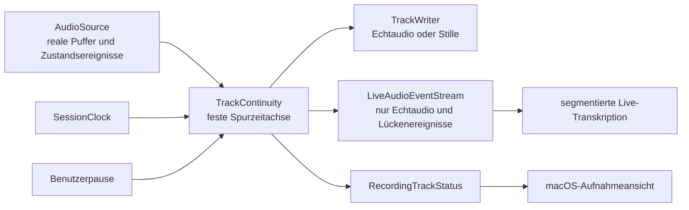

# Mikrofonkontinuität und manuelle Pause

**Datum:** 15. August 2026

**Status:** Fachlich freigegeben.

## Ausgangslage

Steno schreibt Mikrofon und Systemaudio als getrennte, unveränderliche CAF-Originalspuren.

Ein Hardwaretest mit einer isolierten Bibliothek hat zwei stille Ausfälle der macOS-Mikrofonquelle nachgewiesen.
In der Kontrollaufnahme endete die Mikrofonspur nach 306,9 Sekunden, während die Systemspur 363,317 Sekunden erreichte.
In der gezielten AirPods-Aufnahme endete die Mikrofonspur nach 38,571 Sekunden, während Systemspur und sichtbarer Timer bis 59,307 Sekunden weiterliefen.
Im zweiten Fall waren die AirPods vollständig aus CoreAudio verschwunden und macOS hatte die Insta360-Kamera zum neuen Standard-Eingang gemacht.
`AVAudioEngine` meldete keinen Fehler, sondern lieferte einfach keine Mikrofonpuffer mehr.

Der bisherige Aufnahmepfad konnte diese Lücke nicht erkennen.
`TrackWriter` schrieb nur ankommende Puffer, `RecordingSession` kannte keine Quellenunterbrechungen und die macOS-App beobachtete terminale Sessionzustände nicht so wie die iOS-App.

## Ziel

Eine laufende Besprechung bleibt aktiv, wenn das beim Start verwendete Mikrofon vorübergehend ausfällt oder der Benutzer die Mikrofonspur bewusst pausiert.

Während dieser Zeit schreibt Steno ausschließlich Stille in die Mikrofon-Originalspur.
Dadurch bleibt ihre Zeitachse synchron zur Systemspur und zur Meetingzeit.
Kein anderes Mikrofon wird heimlich als Ersatz verwendet.

Kehrt exakt dasselbe Gerät zurück, setzt Steno nach einem Geräteausfall automatisch fort und zeigt den Übergang sichtbar an.
Eine manuell pausierte Mikrofonspur setzt ausschließlich nach einer bewussten Benutzeraktion fort.

## Nicht-Ziele

- Dieses Paket baut noch keine allgemeine Mikrofonauswahl.
- Das bei Aufnahmestart aktive Standardgerät wird nur für diese Aufnahme fest angeheftet.
- Historische, bereits verkürzte Spuren werden nicht nachträglich verändert.
- Das Spurformat wird nicht generell auf 48 kHz vereinheitlicht.
- Die iOS-Unterbrechungspolitik wird ohne erneuten Hardwaretest nicht auf automatische Geräteheilung umgestellt.
- Systemaudio wird während einer manuellen Mikrofonpause nicht pausiert.

## Produktverhalten

### Geräteausfall

Steno merkt sich beim Start die persistente CoreAudio-UID und den sichtbaren Namen des verwendeten Eingabegeräts.
Eine flüchtige `AudioDeviceID` oder die spätere Eigenschaft als Standardgerät reicht nicht als Identität.

Verschwindet das Gerät oder bleibt sein Pufferstrom trotz laufender Quelle aus, wechselt nur die Mikrofonspur in den Zustand `unterbrochen`.
Meetingtimer, Systemspur, Dateisynchronisierung und Verarbeitung laufen weiter.
Die Mikrofonspur wird in begrenzten Blöcken mit Stille bis zur aktuellen Sessionzeit aufgefüllt.

Die Oberfläche zeigt sinngemäß:

> AirPods getrennt.
> Die Mikrofonspur ist pausiert, Systemaudio läuft weiter.

Kehrt dieselbe UID zurück, baut `MicRecorder` seine Engine neu auf, konvertiert gegebenenfalls in das beim Start fixierte Spurformat und setzt automatisch fort.
Die Oberfläche zeigt sinngemäß:

> AirPods wieder verbunden.
> Die Mikrofonaufnahme wurde fortgesetzt.

Ein anderes verfügbares oder neues Standardmikrofon wird niemals automatisch verwendet.

Eine Konfigurationsmeldung einer bereits laufenden `AVAudioEngine` schließt das Puffergate sofort und erzeugt damit eine zeitlich korrekt gefüllte Lücke.
Steno prüft anschließend höchstens eine Sekunde lang, ob genau diese Engine noch läuft und ihre Eingaberoute weiterhin ausschließlich auf die angeheftete Geräte-UID zeigt.
Ist beides erfüllt, darf dieselbe Engine mit einem Epoch-Token wieder geöffnet werden, sodass eine überholte Prüfung niemals eine inzwischen erneut geänderte oder bereits stillgelegte Capture reaktiviert.
Das erste nichtleere Audiopaket muss innerhalb von zwei Sekunden folgen und bestätigt erst dann die Wiederaufnahme.
Bei einer falschen Route, einer gestoppten Engine, einem Timeout oder einem ausbleibenden Puffer greift weiterhin der vollständige Neuaufbau mit einer frischen Engine.
Konfigurationsmeldungen während des initialen Starts werden in die anschließende Routenprüfung einbezogen, statt allein einen weiteren Startversuch auszulösen.

### Manuelle Mikrofonpause

Die Aufnahmeansicht erhält einen eigenen Schalter für `Mikrofon pausieren` und `Mikrofon fortsetzen`.

Während der manuellen Pause werden ankommende Mikrofonpuffer verworfen und durch Stille auf der Writer-Zeitachse ersetzt.
Sie gelangen weder in die Originalspur noch in das Livetranskript.

Kehrt ein zuvor ausgefallenes Gerät während einer manuellen Pause zurück, bleibt die Mikrofonspur pausiert.
Nur der Benutzer kann das Flag `userPaused` zurücksetzen.

## Architektur

Die stille Zeitachsenfüllung gehört in eine eigene portable Schicht `TrackContinuity` in `StenoAudioCore`.
Sie gehört weder in `MicRecorder` noch als Sample-Arithmetik direkt in `RecordingSession`.



`RecordingSession` besitzt je vorhandener Spur genau eine `TrackContinuity`-Instanz.
Quellenpuffer, Quellenereignisse, manuelle Pausen und periodische Ticks werden über diese Instanz serialisiert.
Der bestehende begrenzte Writer-Puffer bleibt die Backpressure-Grenze.
Auch synthetische Stille darf diese Grenze nicht umgehen.

## Zustandsmodell

Geräteverfügbarkeit und Benutzerpause sind orthogonal.
Sie werden nicht in einem einzelnen exklusiven Enum vermischt.

```swift
struct RecordingTrackStatus: Equatable, Sendable {
    var deviceAvailable: Bool
    var userPaused: Bool
    var sourceStalled: Bool
    var deviceName: String?
}
```

Echtaudio wird genau dann geschrieben und live weitergegeben, wenn alle drei Bedingungen erfüllt sind:

```text
deviceAvailable && !userPaused && !sourceStalled
```

Das effektive Kontinuitätsereignis benennt zusätzlich den Grund der Lücke:

- `deviceUnavailable`
- `userPaused`
- `sourceStalled`

Überlagern sich Gründe, bleibt die Spur still, bis keiner mehr aktiv ist.

## Zeitachsenmodell

Das Spurformat wird bei `prepare()` einmal fixiert.
Alle späteren Echtdaten und alle Stille werden in diesem Format an den Writer übergeben.
Kehrt ein Gerät mit einer anderen nativen Rate zurück, konvertiert die Quelle in das fixierte Spurformat.

Die Session besitzt eine monotone Uhr und einen gemeinsamen Startzeitpunkt.
`TrackContinuity` berechnet aus der verstrichenen Hostzeit die Soll-Frameposition jeder Spur.
Die tatsächlich geschriebene Framezahl ist ihre einzige fortlaufende Schreibposition.

Während einer Lücke füllt ein niederfrequenter Tick höchstens 250 Millisekunden Stille pro Block bis zur aktuellen Sollposition.
Damit bleiben Speicher und Writer-Queue auch bei langen Pausen begrenzt.
Ein Absturz während einer Pause hinterlässt höchstens eine Füllperiode Differenz.

Beim ersten Echtdatenpuffer nach einer Lücke wird zunächst bis zu dessen Hostzeit aufgefüllt.
Überlappt der Puffer mit bereits geschriebener Stille, wird nur sein überlappender Anfang verworfen.
Bereits geschriebene Frames werden niemals verändert oder überschrieben.

Innerhalb eines durchgehenden Live-Segments bleibt die heutige Gerätetaktung erhalten.
Nach jeder Lücke wird die Spur erneut an der Hostzeit verankert, damit sich Drift nicht über mehrere Unterbrechungen aufsummiert.

## Quellenvertrag

`AudioSource` erhält zusätzlich zum Pufferhandler einen Handler für Zustandsereignisse.
Eine Standardimplementierung ohne Ereignisse hält bestehende Quellen kompatibel.

```swift
enum AudioSourceEvent: Equatable, Sendable {
    case unavailable(deviceName: String?)
    case available(deviceName: String?)
}
```

`MicRecorder` bleibt für Geräteidentität, Pinning und Wiederaufbau zuständig.
Er erzeugt selbst keine Stille.

Direkt beim Aufnahmeklick liest die App die UID des zu diesem Zeitpunkt gewählten Standardmikrofons, bevor der Systemaudio-Aufbau den CoreAudio-Graphen verändern kann.
`MicRecorder` bindet die Input-AudioUnit anschließend ausdrücklich an die aktuelle `AudioDeviceID` genau dieser UID und installiert Listener für Geräteliste und Lebenszustand.
Eine beim früheren Berechtigungs-Probelauf beobachtete Mikrofon-UID wird weder gespeichert noch als spätere Aufnahmeauswahl verwendet.
Ein Wechsel des System-Standardinputs allein ändert die laufende Quelle nicht.

Bei Rückkehr derselben UID wird dieselbe langlebige Engine erst nach einer stabilen Gerätephase neu konfiguriert.
Tap und laufender Audio-Unit werden vollständig gestoppt, ohne die Engine während noch laufender CoreAudio-Callbacks freizugeben.
Das neue native Format wird auf das beim Start fixierte Spurformat konvertiert.

Property-Listener reichen als einzige Sicherung nicht aus.
Ein Watchdog prüft deshalb, ob eine als laufend markierte Quelle weiterhin Puffer liefert.
Nach spätestens zwei Sekunden ohne Puffer meldet die Quelle `unavailable` und versucht einen kontrollierten Neuaufbau mit derselben UID.
`TrackContinuity` erkennt denselben stillen Stall unabhängig davon und füllt rückwirkend ab dem Ende des letzten gültigen Puffers.

`SystemAudioRecorder` beobachtet ausschließlich den Wechsel des Standard-Ausgabegeräts.
Änderungen der gesamten CoreAudio-Geräteliste lösen keinen Neuaufbau aus, weil Stenos privates Tap-Aggregat und Mikrofon-Routenwechsel diese Liste selbst verändern und andernfalls einen zweiten, rückgekoppelten Regelkreis erzeugen.
Ab dem initialen Start prüft ein fortlaufender Vier-Sekunden-Watchdog, ob der IO-Callback tatsächlich einen nichtleeren, konvertierten Puffer an den Writer weitergegeben hat.
Ein still gebliebener Neuaufbau erhält höchstens zwei zusätzliche Versuche; harte Startfehler behalten ihre bereits begrenzten drei Wiederanläufe.
Generationstoken verhindern, dass bereits abgelöste Rebuild- oder Watchdog-Tasks nach ihrer Abbruchanforderung verspätet einen weiteren CoreAudio-Umbau auslösen.

## Livetranskription

Synthetische Stille wird ausschließlich an den Writer gesendet.
Sie wird niemals als Audio an einen Speech-Provider übergeben.

Der Livepfad erhält statt eines reinen Pufferstroms einen Ereignisstrom:

```swift
struct LiveAudioBuffer: @unchecked Sendable {
    let buffer: AVAudioPCMBuffer
}

enum LiveAudioEvent: Sendable {
    case buffer(LiveAudioBuffer)
    case gapStarted(at: TimeInterval, reason: TrackGapReason)
    case gapEnded(at: TimeInterval)
}
```

`LiveAudioBuffer` besitzt immer eine Kopie des Engine-Puffers und nie einen von AVFoundation geliehenen Speicherbereich.

Bei `gapStarted` beendet die App die aktuelle Live-Transkriptionssitzung sauber.
Bei `gapEnded` startet sie mit dem nächsten Echtdatenpuffer eine neue Sitzung.
Zeitangaben des neuen Segments werden um die Meetingzeit des Segmentstarts verschoben.

So entstehen während langer Nullstrecken keine Halluzinationen und die provisorische Revision bleibt auf der Meetingzeitachse ausgerichtet.
Der finale ASR-Lauf arbeitet später wie bisher auf den vollständigen CAF-Spuren.

## macOS-Oberfläche

Die Aufnahmeansicht zeigt den effektiven Mikrofonzustand neben Pegel und Steuerung.

- Aktiv: normaler Pegel und Aktion `Mikrofon pausieren`.
- Manuell pausiert: klarer Pausenstatus und Aktion `Mikrofon fortsetzen`.
- Gerät fehlt: Gerätename, Hinweis auf weiterlaufendes Systemaudio und keine manuelle Fortsetzungsaktion, solange das Gerät fehlt.
- Gerät zurück, aber manuell pausiert: Gerät verfügbar, Spur bleibt pausiert.

Statuswechsel dürfen den Meetingtimer oder den Stop-Knopf nicht verdecken.
Die globale Meldungsleiste erhält die einmaligen Meldungen für Verlust und automatische Fortsetzung.

Die bestehende macOS-Pegelabfrage beobachtet zusätzlich Session- und Spurzustände.
Ein terminaler Sessionzustand nimmt denselben vollständigen Stop-Nachlauf wie ein Benutzerstopp, damit Writerpräfixe, Live-Revision und finaler ASR-Job erhalten bleiben.

## iOS-Abgrenzung

`TrackContinuity`, der Pausenvertrag und der neue Live-Ereignisstrom sind portabel und werden von beiden Apps gebaut.
Die iOS-App wird an den neuen Stream angepasst, ohne ihre bereits hardwaregeprüfte Unterbrechungsentscheidung in diesem Paket zu ändern.

Eine automatische Wiederaufnahme externer iOS-Eingabegeräte braucht einen eigenen Gerätetest.
Bis dahin darf ein iOS-Routenverlust weiterhin die Session sicher beenden.

## Invarianten

1. Die Differenz zwischen Sessionzeit und geschriebener Spurdauer beträgt beim sauberen Stop höchstens eine Audiopufferlänge.
2. Während `userPaused`, `deviceAvailable == false` oder `sourceStalled` erreicht kein Echtaudio den Writer oder den Live-Provider.
3. Stille erreicht ausschließlich den Writer.
4. Schreibpositionen sind streng monoton und bereits geschriebene Frames bleiben unverändert.
5. Automatische Wiederaufnahme ist nur für dieselbe persistente Geräte-UID erlaubt.
6. Eine manuelle Pause wird niemals durch ein Geräteereignis aufgehoben.
7. Jede periodische Füllung ist begrenzt und benutzt dieselbe Writer-Backpressure wie Echtaudio.
8. Ein Geräte-, Writer-, Speicher- oder Ringpufferfehler darf die bereits geschriebene Aufnahme nicht verwerfen.
9. Fehlende Sprachmodelle oder Live-Transkriptionsfehler verändern den Aufnahmezustand weiterhin nicht.

## Automatisierte Abnahme

### `StenoAudioCore`

- Eine Lücke zwischen zwei Echtdatenabschnitten erzeugt die handberechnete Zahl stiller Frames.
- Ein stiller Stall ohne Quellenereignis wird vom Watchdog rückwirkend ab dem letzten Pufferende gefüllt.
- Ein überlappender erster Puffer nach Wiederaufnahme wird vorne getrimmt und nicht doppelt geschrieben.
- Benutzerpause und Geräteverlust können sich überlagern, ohne automatisch die Benutzerpause aufzuheben.
- Ein Stop während einer Lücke füllt exakt bis zur Stoppzeit.
- Eine lange simulierte Pause benutzt ausschließlich begrenzte Stilleblöcke und begrenzte Queues.
- Der Live-Ereignisstrom enthält während einer Lücke keine Audiopuffer.
- Ein simulierter schneller oder langsamer Gerätetakt wird nach einer Lücke wieder an der Hostzeit verankert.
- Capture-Recovery kann weiterhin alle bis zum Absturz synchronisierten Präfixe übernehmen.

### `StenoMacAudio`

- Ein neuer Standardinput bei weiterhin vorhandener ursprünglicher UID wechselt die Quelle nicht.
- Eine verschwundene UID meldet genau einmal `unavailable`.
- Nur dieselbe UID löst Wiederaufbau und `available` aus.
- Ein Wiederaufbau mit 24-zu-48-kHz-Wechsel liefert weiterhin das fixierte Spurformat.
- Ein stiller Engine-Stall löst den Watchdog aus und startet kontrollierte Wiederholungsversuche.

### Apps

- Die macOS-Steuerung pausiert ausschließlich die Mikrofonspur.
- Ein zurückgekehrtes Gerät setzt nur eine nicht manuell pausierte Spur automatisch fort.
- Live-Ausgaben mehrerer Segmente behalten ihre Meetingzeitverschiebung.
- iOS baut gegen den neuen Live-Ereignisvertrag und behält seinen sicheren Unterbrechungsstopp.

## Manuelle Hardwareabnahme

1. AirPods als Startmikrofon auswählen, Aufnahme starten, in das Case legen und erneut verbinden.
2. Prüfen, dass Systemspur und Timer durchlaufen, die Mikrofonspur während der Lücke Stille enthält und danach automatisch weiterläuft.
3. Während laufender AirPods-Aufnahme den System-Standardinput auf ein anderes Gerät ändern, ohne die AirPods zu trennen.
4. Prüfen, dass Steno am angehefteten AirPods-Mikrofon bleibt.
5. Mikrofon manuell pausieren, sprechen, fortsetzen und prüfen, dass nur Stille in der Pause liegt.
6. AirPods während einer manuellen Pause trennen und wieder verbinden.
7. Prüfen, dass die Spur bis zur manuellen Fortsetzung still bleibt.
8. Die App während einer mehrminütigen Lücke hart beenden und Capture-Recovery prüfen.

Der abschließende echte AirPods-Test bleibt nach der automatisierten Abnahme erforderlich.

## Zweitmeinung

Claude Fable hat den Entwurf vor Erstellung dieser Spec unabhängig geprüft.
Übernommen wurden insbesondere die eigene `TrackContinuity`-Schicht, UID-basierte Geräteidentität, periodische statt nachträgliche Füllung, Transkriptsegmentierung ohne Nullpuffer und ein Watchdog zusätzlich zu CoreAudio-Ereignissen.
Die vermutete Relevanz der Kontinuitätsschicht für Systemaudio wird durch automatisierte Tests abgesichert, aber nicht als bereits hardwarebeobachteter Systemspurfehler ausgegeben.

## Referenzabgleich mit bestehenden Implementierungen

Der abschließende Reconnect-Pfad wurde gegen OpenOats `fd88f35`, `d47c230` und `ba9fe05` verglichen.
Übernommen wurden der auf das Standard-Ausgabegerät begrenzte Listener und der zeitlich begrenzte Frame-Watchdog nach einem Bluetooth-Neuaufbau.
Ein erster Steno-Versuch mit kurzlebigen Engines crashte, weil CoreAudio nach deren Freigabe noch Audio-Unit-Callbacks ausführte.
Der folgende Versuch mit einer einzigen wiederverwendeten Engine crashte zwar nicht, lieferte nach der AirPods-Rückkehr aber keine Puffer mehr und konnte den Stop-Pfad während eines blockierenden CoreAudio-Abbaus verzögern.
Die Hardwareaufnahme vom 15.08.2026 belegt 18,273 Sekunden Stille vor dem ersten Mikrofonpuffer und 45,306 Sekunden ununterbrochene Stille nach dem Geräteverlust bis zum Aufnahmeende.

OpenOats verwendet bei jedem Neustart eine frische `AVAudioEngine` und hält ausgemusterte Engines weiter am Leben, damit verspätete CoreAudio-Callbacks nicht auf freigegebenen Speicher treffen.
Das Projekt [`macos-mic-keepwarm`](https://github.com/drewburchfield/macos-mic-keepwarm) dokumentiert zusätzlich blockierende `AVCaptureSession.stopRunning()`-Aufrufe nach dem Verschwinden von Bluetooth-Geräten und verlagert den Hardware-Abbau deshalb aus seinem Steuerpfad.
Steno übernimmt diese beiden Lebenszyklusprinzipien für `AVAudioEngine`, behält aber seine strengere Gerätebindung ohne Fallback auf das aktuelle Standardmikrofon.
Jeder Start- und Reconnect-Versuch erhält eine frische Engine und eine eigene serielle Hardware-Queue.
Der Actor wartet niemals synchron auf `removeTap` oder `stop`, sondern schließt zuerst das synchrone Capture-Gate, verwirft die aktive Generation und finalisiert die Aufnahme unabhängig vom Hardware-Abbau.
Eine ausgemusterte Engine bleibt bis zum tatsächlichen Abschluss ihres Abbaus stark referenziert.
Es gibt bewusst keine erzwungene zahlenbasierte Freigabe, weil eine noch blockierte neunte Engine sonst denselben Use-after-free-Crash erneut auslösen könnte.
Start und Vorbereitung haben je ein Fünf-Sekunden-Limit, und ein gestarteter Capture-Versuch ohne strukturell gültigen Puffer wird nach fünf Sekunden vom Watchdog ersetzt.
`available` wird nach einem Reconnect erst mit dem ersten weitergegebenen Puffer mit `frameLength > 0` gemeldet; digitale Stille ist dabei weiterhin ein gültiger Puffer.

Claude Fable 5 bestätigte den Wechsel zu frischen Engines, abschlussgebundener Aufbewahrung und nicht blockierendem Abbau als kleinste sichere Änderung innerhalb des bestehenden AVAudioEngine-Pfads.
Die weitergehende Empfehlung, den Mikrofonpfad vollständig auf rohe CoreAudio-IO-Procs umzustellen, wurde für diesen Fix bewusst nicht übernommen, weil sie einen neuen Capture-Pfad ohne lokale Hardwarebewährung schaffen würde.
Der Electron/Web-Audio-Pfad von Steno Legacy fällt bei einem verschwundenen fest gewählten Mikrofon auf das System-Standardgerät zurück und ist deshalb für diese Anforderung keine geeignete Vorlage.
